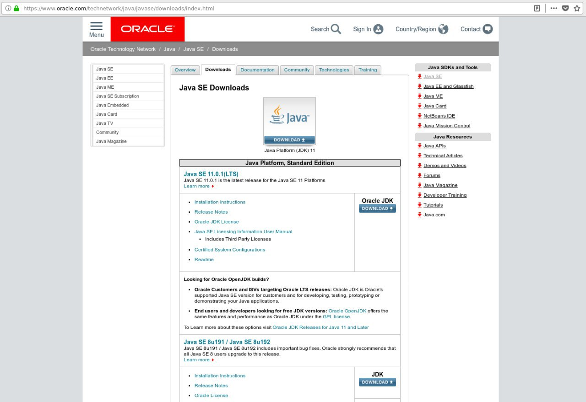

이 문서는 기본적으로 [OpenTSDB 설치 Document](http://opentsdb.net/docs/build/html/installation.html)를 참고하여 작성하였다. 또한 Linux 배포판 중의 하나인 Ubuntu를 기준으로 작성하였다.

## [ Java 환경 설치 확인 ]
```
java -version
```
위의 명령어를 사용해서 자바가 이미 설치되어있는지 확인한다. 이미 자바가 설치되어있다면 현재 문서를 건너뛰고 다음 과정으로 넘어가길 바란다.

## [ Java 다운로드 및 설치 ]

[Java 다운로드 및 설치 참고(https://opentutorials.org/module/516/5558)](https://opentutorials.org/module/516/5558)는 이곳을 참고하면 너무도 자세히 잘 나와있다. 필자의 경우도 이곳에 나와있는 그대로 따라했더니 설치가 가능했다. 그래도 한번 정리해보자.

### 1. Java Download
구글에서 java jdk download를 검색하거나 직접 오라클 다운로드 페이지에 접속한다. 이 글을 작성하는 시점(2019-01-08)에서 다운로드 페이지는 아래의 링크와 같다.<br/>
[https://www.oracle.com/technetwork/java/javase/downloads/index.html](https://www.oracle.com/technetwork/java/javase/downloads/index.html)




