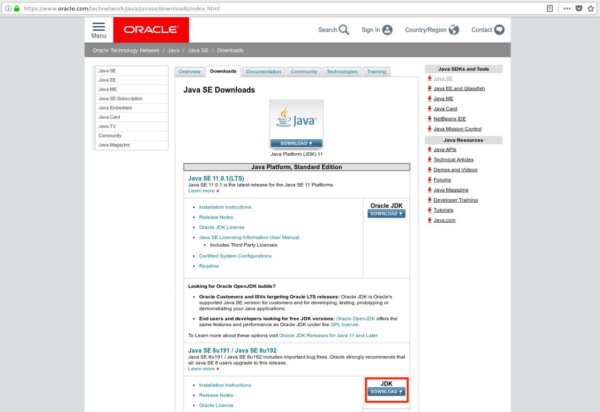
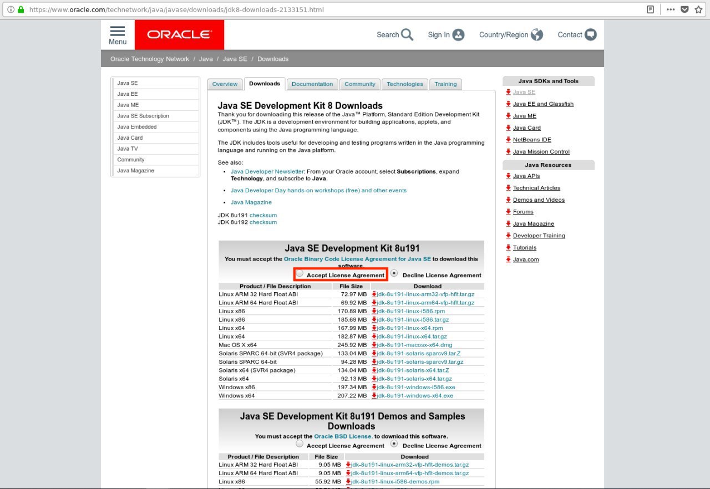

이 문서는 기본적으로 [OpenTSDB 설치 Document](http://opentsdb.net/docs/build/html/installation.html)를 참고하여 작성하였다. 또한 Linux 배포판 중의 하나인 Ubuntu를 기준으로 작성하였다.

## [ Java 환경 설치 확인 ]
아래의 명령어를 사용해서 자바가 이미 설치되어있는지 확인한다. 이미 자바가 설치되어있다면 현재 문서를 건너뛰고 다음 과정으로 넘어가길 바란다.

```
taewoo@ubuntu:~$ java -version
```

## [ Java 다운로드 및 설치 ]

[Java 다운로드 및 설치 참고(https://opentutorials.org/module/516/5558)](https://opentutorials.org/module/516/5558)는 이곳을 참고하면 너무도 자세히 잘 나와있다. 필자의 경우도 이곳에 나와있는 그대로 따라했더니 설치가 가능했다. 아마 위의 글과 거의 비슷한 문서가 될테지만 그래도 한번 정리해보자.<br/>

OpenTSDB 공식문서에는 'Java Runtime Environment 1.6 or later' 즉 자바 실행 환경이 필요하다고 되어있지만, 우리는 더 큰 개념인 자바 개발도구(Java Development Kit, JDK)를 설치하도록 하자. JRE, JDK 이 둘의 차이는 다음의 URL에서 자세히 확인할 수 있다.<br/>
[https://wikidocs.net/257](https://wikidocs.net/257)

### Download
구글에서 java jdk download를 검색하거나 직접 오라클 다운로드 페이지에 접속한다. 이 글을 작성하는 시점(2019-01-08)에서 다운로드 페이지는 아래의 링크와 같다.<br/><br/>
[https://www.oracle.com/technetwork/java/javase/downloads/index.html](https://www.oracle.com/technetwork/java/javase/downloads/index.html)
<br/>



위의 이미지에서 빨간색 박스로 표시된 다운로드 버튼을 누른다. 맨 위의 최신 버전을 다운받지 않는 이유는 많은 버그들이 수정된 recommend 버전을 다운받는 것을 추천하기 때문이다. 다운로드 버튼을 누르면 아래와 같은 화면이 나온다.
<br/>



라이센스에 동의하는 체크를 한 뒤, 다운받기에 앞서 위의 명령어를 통해 자신의 리눅스가 32bit인지 64bit인지 확인할 필요가 있다. 32bit라면 x86라고 되어있는 .tar.gz 파일을 64bit라면 x64라고 되어있는 .tar.gz 파일을 다운받는다. 필자의 경우 64bit이기때문에 jdk-8u191-linux-x64.tar.gz 파일을 다운받았다.

```
taewoo@ubuntu:~$ getconf LONG_BIT
```

### 2. Install

아래와 같이 자바를 설치할 폴더를 생성한다.

```
sudo mkdir -p /usr/local/java
```

그리고 다운로드 받은 파일을 자바를 설치할 폴더로 옮긴다.

```
sudo mv jdk-8u191-linux-x64.tar.gz /usr/local/java/
```

자바를 설치할 폴더로 이동하여 다운로드한 파일의 압축을 푼다.

```
cd /usr/local/java;
sudo tar xvfz /usr/local/java/jdk-8u191-linux-x64.tar.gz
```

/etc/profile 파일을 변경해서 JAVA_HOME 환경변수를 설정해준다.

```
sudo nano /etc/profile
```
```
export JAVA_HOME=$(readlink -f /usr/bin/java | sed "s:bin/java::")
```

아래의 명령어들을 통해 java를 기본 명령어로 등록한다. 여기서 주의할 점은 필자의 경우 위에서 다운로드한 파일의 압축을 풀었을 때, 'jdk1.8.0_191'이라는 이름의 폴더가 생겨서 아래와 같이 명령어를 입력한 것이다. 독자의 경우 위에서 생성한 자바를 설치할 폴더(/usr/local/java)아래에 생성된 폴더의 이름을 아래의 명령어에서 jdk1.8.0_191 대신에 입력하면 될 것이다.

```
sudo update-alternatives --install "/usr/bin/java" "java" "/usr/local/java/jdk1.8.0_191/bin/java" 1;
sudo update-alternatives --install "/usr/bin/javac" "javac" "/usr/local/java/jdk1.8.0_191/bin/javac" 1;
sudo update-alternatives --install "/usr/bin/javaws" "javaws" "/usr/local/java/jdk1.8.0_191/bin/javaws" 1;
sudo update-alternatives --install "/usr/bin/jar" "jar" "/usr/local/java/jdk1.8.0_191/bin/jar" 1;
```
```
sudo update-alternatives --set java /usr/local/java/jdk1.8.0_191/bin/java;
sudo update-alternatives --set javac /usr/local/java/jdk1.8.0_191/bin/javac;
sudo update-alternatives --set javaws /usr/local/java/jdk1.8.0_191/bin/javaws;
sudo update-alternatives --set jar /usr/local/java/jdk1.8.0_191/bin/jar;
```

마지막으로 변경사항을 반영해준다.

```
. /etc/profile
```

### 3. Check

지금까지 설치가 모두 잘 되었다면 아래의 명령어를 입력했을 때, 설치된 자바의 버전이 출력될 것이다. 필자의 경우 아래와 같이 출력되었다.

```
taewoo@ubuntu:~$ java -version
java version "1.8.0_191"
Java(TM) SE Runtime Environment (build 1.8.0_191-b12)
Java HotSpot(TM) 64-Bit Server VM (build 25.191-b12, mixed mode)
```