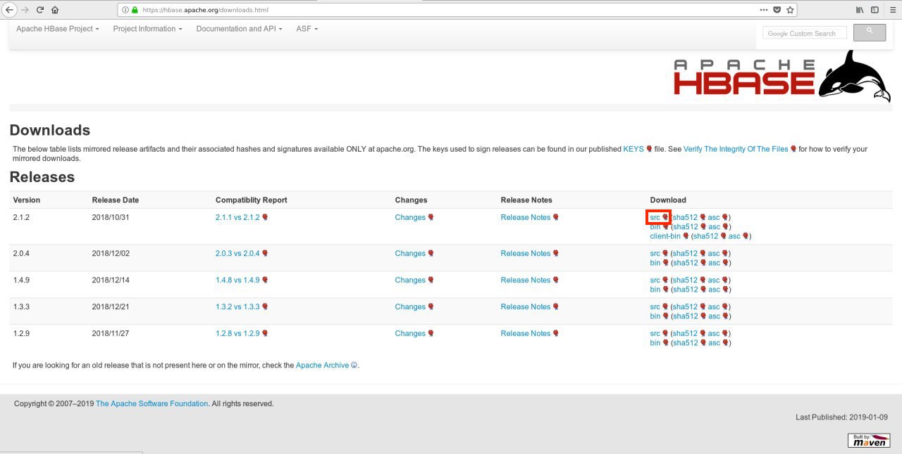
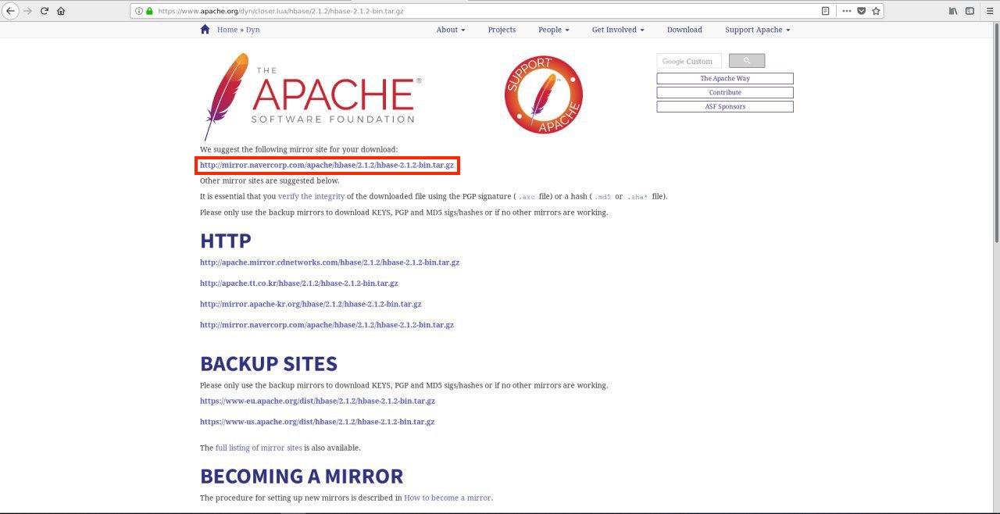
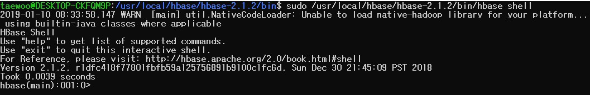
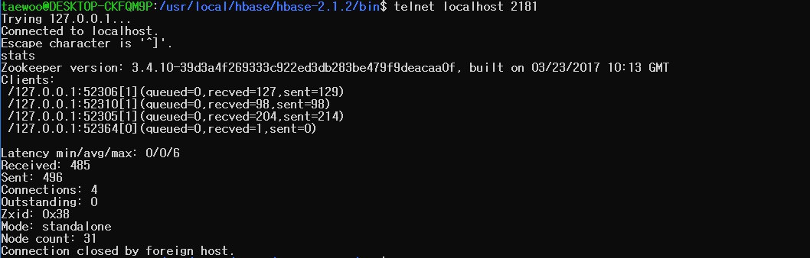

이 문서는 기본적으로 [OpenTSDB 설치 Document](http://opentsdb.net/docs/build/html/installation.html)를 참고하여 작성하였다. 또한 Linux 배포판 중의 하나인 Ubuntu를 기준으로 작성하였다.

## [ HBase 다운로드 및 설치 ]
OpenTSDB는 기본적으로 HBase 위에서 동작하는 시계열 데이터베이스이기때문에 HBase 설치가 필요하다. HBase를 동작시키는 모드는 크게 'Standalone 모드'와 'Distributed 모드'로 나뉜다. 이 문서에서는 OpenTSDB를 설치하기 위한 과정을 간단히 설명하기 위해 'Standalone 모드'로 동작시키는 것을 기준으로 작성할 것이다.
<br/><br/>
~~(사실 Distributed 모드로 시스템을 구축해본 적이 없기도 하다. 원하시는 독자분들은 이곳을 참고해보시길 http://hbase.apache.org/0.94/book/standalone_dist.html)~~
<br/>


### 1. Download
구글에서 apache hbase download를 검색하거나 직접 HBase 다운로드 페이지에 접속한다. 이 글을 작성하는 시점(2019-01-09)에서 다운로드 페이지는 아래의 링크와 같다.<br/><br/>
[https://hbase.apache.org/downloads.html](https://hbase.apache.org/downloads.html)
<br/>

HBase 다운로드 페이지로 가면 아래의 이미지에서와 같이 각 버전별 다운로드 URL 링크가 있다. 다운로드 파일에는 src(source packetage) 파일과 bin(binary packetage) 파일 형식이 있지만, 특별한 설정을 하려고 하는게 아닌 이상 간편한게 최고니까 bin 파일을 다운받로록 하자.
<br/>



해당하는 링크를 누르고나서 파일이 다운로드 되는 것이 아니라 아래와 같은 화면이 나올 수 있는데, 당황하지말고 페이지에서 하라는대로 다운로드 url을 눌러준다.
<br/>



이렇게 필자는 hbase-2.1.2-bin.tar.gz 파일을 다운받았다.

### 2. Install

아래와 같이 HBase를 설치할 폴더를 생성한다.

```
sudo mkdir -p /usr/local/hbase 
```

그리고 다운로드 받은 파일을 HBase를 설치할 폴더로 옮긴다.

```
sudo mv hbase-2.1.2-bin.tar.gz /usr/local/hbase/
```

HBase를 설치할 폴더로 이동하여 다운로드한 파일의 압축을 푼다.

```
cd /usr/local/hbase;
sudo tar xvfz /usr/local/hbase/hbase-2.1.2-bin.tar.gz
```

### 3. Configurations

설정 파일인 hbase_env.sh 파일과 hbase_site.xml 파일의 내용을 수정한다. 필자의 경우 아래와 같은 경로에 hbase_env.sh에 있다. 참고로, 현재까지 필자가 경험한 바로는 conf/ 폴더내에 hbase_env.sh 파일과 hbase_site.xml 파일 모두 들어있었다.


#### 3.1 hbas_env.sh 수정

```
sudo vi /usr/local/hbase/hbase-2.1.2/conf/hbase_env.sh
```

(Required) 자바가 설치되어있는 위치의 경로를 입력해준다. 이전 문서인 OpenTSDB Install-(1) JDK 설치를 확인하면 알 수 있지만, 필자의 경우에는 /usr/local/java/jdk1.8.0_191에 설치되어있다.

```
(변경 전)
# The java implementation to use.  Java 1.8+ required.
# export JAVA_HOME=/usr/java/jdk1.8.0/

->

(변경 후)
# The java implementation to use.  Java 1.8+ required.
export JAVA_HOME=/usr/local/java/jdk1.8.0_191
```

(Optional) 필수 수정사항은 아니지만, JVM Garbage Collector를 Concurrent Mark & Sweep GC(CMS)에서 Garbage First GC(G1 GC)로 변경해준다. 참고로, JDK 6에서는 G1 GC를 early access라고 부르며 그냥 시험삼아 사용할 수만 있도록 한다. 그리고 JDK 7에서 정식으로 G1 GC를 포함하여 제공한다. 즉, 제대로 G1 GC를 사용하려면 JDK 7 이상이어야 한다. 
<br/>

이러한 GC 설정은 후에 대용량의 데이터를 다룰 때, STM(stop-the-world) 상황이 적게 일어나도록 하기 위함이다. STM 상황이 자주, 오래 일어나게 되면, OpenTSDB를 실행하고 있을때 zookeeper 세션의 연결이 끊어질 가능성이 높아진다. 그렇게 되면 DB가 먹통이 되어버려서 HBase와 OpenTSDB를 재실행 시켜야하는 상황이 발생하게 된다. Garbage Collector와 STM에 대하여 자세히 확인해보고 싶은 독자들은 아래의 링크를 참고하는 것을 추천한다. 

[Java Garbage Collection - https://d2.naver.com/helloworld/1329](https://d2.naver.com/helloworld/1329)
<br/>

```
(변경 전)
# Extra Java runtime options.
# Below are what we set by default.  May only work with SUN JVM.
# For more on why as well as other possible settings,
# see http://hbase.apache.org/book.html#performance
export HBASE_OPTS="$HBASE_OPTS -XX:+UseConcMarkSweepGC"

->

(변경 후)
# Extra Java runtime options.
# Below are what we set by default.  May only work with SUN JVM.
# For more on why as well as other possible settings,
# see http://hbase.apache.org/book.html#performance
export HBASE_OPTS="$HBASE_OPTS -XX:+UseG1GC"
```

#### 3.2 hbase_site.xml 수정

```
sudo vi /usr/local/hbase/hbase-2.1.2/conf/hbase_site.xml
```

hbase_site.xml에서는 HBase의 데이터가 저장될 위치와 메모리에 담겨있던 데이터가 날아가도 ZooKeeper의 스냅샷이 저장될 위치를 지정해준다. 이를 설정해주지 않고 컴퓨터를 종료하면 HBase에 저장되었던 데이터와 스냅샷 데이터가 모두 소멸된다.
<br/>

필자의 경우 아래와 같이 root 디렉토리 위에 data/hbase-2.1.2/ 폴더에 HBase 데이터와 ZooKeeper 데이터를 저장하도록 지정했다. 참고로, 해당 경로는 미리 만들어놓지 않아도 HBase를 실행시키면 자동으로 생성된다.

```
(변경 전)
<configuration>
</configuration>

->

(변경 후)
<configuration>
        <property>
                <name>hbase.rootdir</name>
                <value>file:///data/hbase-2.1.2/hbase</value>
        </property>

        <property>
                <name>hbase.zookeeper.property.dataDir</name>
                <value>file:///data/hbase-2.1.2/zookeeper</value>
        </property>
</configuration>
```

### 4. Check

HBase가 제대로 설치되었는지 확인하기 위해 hbase가 설치된 폴더의 bin/ 폴더로 이동한다. 필자의 경우 해당 경로는 아래와 같았다.

```
cd /usr/local/hbase/hbase-2.1.2/bin
```

HBase를 실행하는 쉘스크립트를 실행한다.

```
sudo /usr/local/hbase/hbase-2.1.2/bin/start-hbase.sh
```

hbase shell을 실행시켜본다. shell을 실행했을때, 아래의 사진처럼 나온다면 제대로 hbase shell이 실행된 것이다.

```
sudo /usr/local/hbase/hbase-2.1.2/bin/hbase shell
```



그리고 telnet을 통해 ZooKeeper가 정상적으로 작동하고 있는지 확인한다. 아래의 명령어를 실행후 stats를 입력했을 때, 아래의 사진처럼 나온다면 제대로 ZooKeeper가 실행되고 있는 것이다.

```
telnet localhost 2181
```


