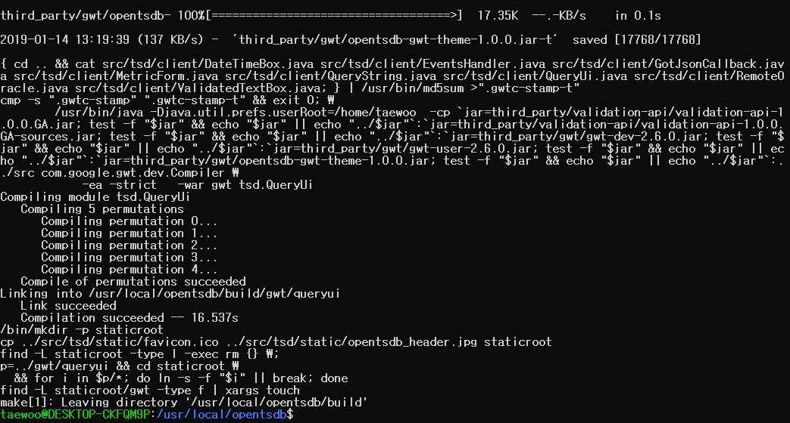
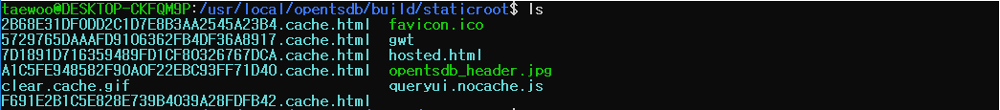
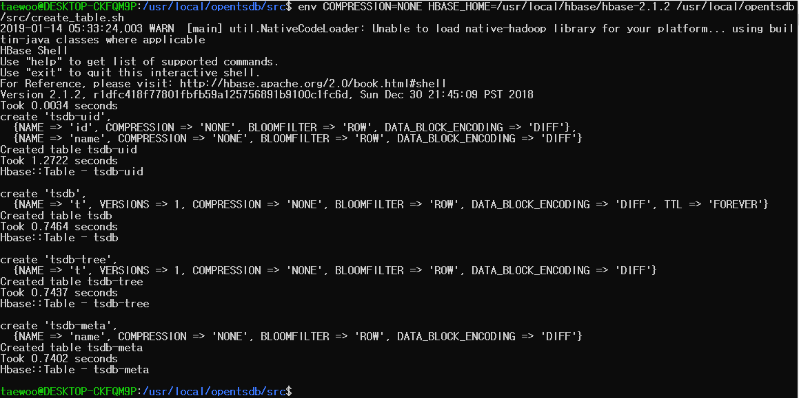
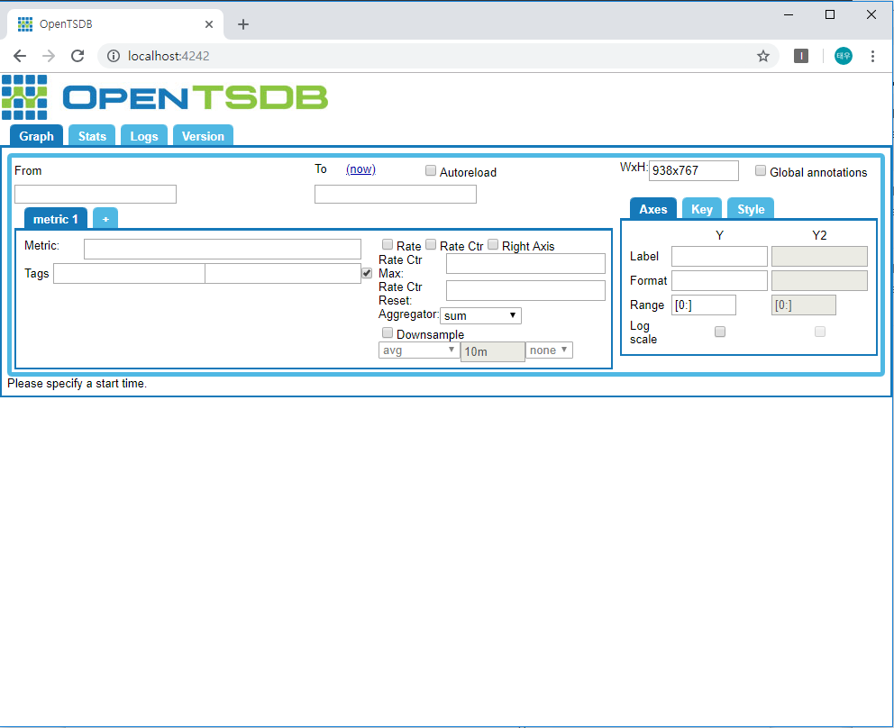

이 문서는 기본적으로 [OpenTSDB 설치 Document](http://opentsdb.net/docs/build/html/installation.html)를 참고하여 작성하였다. 또한 Linux 배포판 중의 하나인 Ubuntu를 기준으로 작성하였다.


## [ OpenTSDB 구동 및 설치 조건 확인 ]

- Linux 시스템 <br/>(~~Widows에서도 manual building으로 구동할 수 있다고는 하나, 이 문서에서는 다루지 않는다.~~)

- JDK(Java Development Kit) 1.6 이상

- HBase 0.92 이상

- GnuPlot 4.2 이상

- Autotools (autoconf, automake, libtool)

- Make

- Python
- Git

- 인터넷 연결


이전의 과정에서 JDK 설치 방법과 HBase 설치 방법을 자세히 다루었으므로 이 문서에서는 생략하도록 한다. 


패키지들을 설치하기 전에, 패키지 리스트를 업데이트 시켜준다.

```
sudo apt-get update
```


GnuPlot 설치

```
sudo apt-get install gnuplot
```


GNU 빌드시스템(GNU build system), 간단히 얘기해서 Autotools 설치

```
sudo apt-get install autoconf automake libtool
```


 Make 설치

```
sudo apt-get install make

# 꼭 필요는 없지만 make와 함께 사용되는 다른 툴들도 함께 설치하는 것을 추천
sudo apt-get install build-essential
```


Linux라면 Python은 기본적으로 설치되어 있을테니까 Pass


Git 설치

```
sudo apt-get install git
```


## [ OpenTSDB 다운로드 및 설치 ]

OpenTSDB를 설치하기 위해 만반의 준비를 다 했으니, 이제 본격적으로 설치를 진행해보도록 하자.


### 1. Download (git clone)

OpenTSDB를 clone 해 올 위치로 이동한다.

```
cd /usr/local
```


OpenTSDB repository에서 clone 해온다. 그러면 현재 디렉토리 내에 opentsdb라는 폴더가 생성된다. 필자의 경우 /usr/local/opentsdb 폴더가 생성되었다.

```
sudo git clone git://github.com/OpenTSDB/opentsdb.git
```


### 2. Install

git clone으로 생성된 폴더로 이동하여 build.sh 파일을 실행시킨다. 만일 다음 코드가 정상적으로 실행되었다면, 아래의 사진처럼 결과가 나올 것이다.

```
cd /usr/local/opentsdb
sudo /usr/local/opentsdb/build.sh
```




### 3. Configurations

OpenTSDB에서 설정해주어야 할 것은 크게 두가지가 있다.  opentsdb.conf 파일수정과 OpenTSDB의 스크립트를 이용하여 HBase에 테이블 생성하기.


#### 3.1 opentsdb.conf 파일 수정

먼저 opentsdb.conf 파일을 수정해보자.  파일의 내용 중 각각에 해당하는 내용을 찾아서 '(변경후)' 내용으로 수정하면 된다. 

```
cd /usr/local/opentsdb/src
sudo vi /usr/local/opentsdb/src/opentsdb.conf
```


(Required) OpenTSDB가 연결될 포트 번호를 지정해준다.

```
(변경 전)
# --------- NETWORK ----------
# The TCP port TSD should use for communications
# *** REQUIRED ***
tsd.network.port =

->

(변경 후)
# --------- NETWORK ----------
# The TCP port TSD should use for communications
# *** REQUIRED ***
tsd.network.port = 4242
```


(Required) OpenTSDB web UI의 javascript 파일 등의 static file들이 있는 위치를 찾아서 지정해준다. 필자의 경우에는 아래의 사진과 같은 파일들이 담긴 staticroot 폴더가 /usr/local/opentsdb/build/staticroot 위치에 있었다. 그리고 OpenTSDB의 캐시파일이 저장될 위치를 지정해준다.

```
(변경 전)
# ----------- HTTP -----------
# The location of static files for the HTTP GUI interface.
# *** REQUIRED ***
tsd.http.staticroot =

# Where TSD should write it's cache files to
# *** REQUIRED ***
tsd.http.cachedir =

->

(변경 후)
# ----------- HTTP -----------
# The location of static files for the HTTP GUI interface.
# *** REQUIRED ***
tsd.http.staticroot = /usr/local/opentsdb/build/staticroot

# Where TSD should write it's cache files to
# *** REQUIRED ***
tsd.http.cachedir = /tmp/opntsdb
```




(Optional) 새로운 metric을 입력받았을 때, 자동으로 OpenTSDB에 생성해줄 수 있도록 수정해준다. 이는 Default 값이 False로 되어있다. 이유는 외부로부터 알 수 없는 데이터나 공격을 받는 것을 막아주기 위해 있는 기능인 듯 하다. 우리는 테스트를 보다 간단하게 하기 위해 그냥 True로 바꿔준다.

```
(변경 전)
# --------- CORE ----------
# Whether or not to automatically create UIDs for new metric types, default
# is False
#tsd.core.auto_create_metrics = false

->

(변경 후)
# --------- CORE ----------
# Whether or not to automatically create UIDs for new metric types, default
# is False
tsd.core.auto_create_metrics = true
```


(Optional) 자동으로 데이터베이스에서 압축이 일어나지 않도록 수정한다. OpenTSDB에 입력하는 데이터의 양이 많지 않을 경우는 상관 없지만, 짧은 시간안에 많은 양의 데이터를 OpenTSDB에 입력하려고 할 경우에는 문제가 생길 가능성이 있다. 데이터 압축에 사용되는 리소스 때문에 JVM 환경에 따라 STW('Stop The World') 상황이 발생할 가능성이 높아지고 결국 문제가 발생하게 되는 것이다. 자동으로 압축이 일어나도록 설정하면 저장되어 있는 데이터를 쿼리할 때 속도가 빨라지겠지만, 위와 같은 상황에는 문제가 발생할 가능성이 크다.

```
(변경 전)
# --------- STORAGE ----------
# Whether or not to enable data compaction in HBase, default is True
#tsd.storage.enable_compaction = true

->

(변경 후)
# --------- STORAGE ----------
# Whether or not to enable data compaction in HBase, default is True
tsd.storage.enable_compaction = false
```


(Optional) 이제부터는 기존 파일에 없는 내용을 추가로 적어서 수정해야 하는데, 이 수정 내용들은 필자의 경험상 필요했던 내용들이다. 'tsd.storage.fix_duplicates = true'는 데이터가 덮어씌어졌을 때, 최신의 값으로 유지하는 것이다 'tsd.http.request.enable_chunked = true'는 한번에 여러 개의 Data Point를 저장할 수 있도록 허용하는 것이다. 'tsd.http.request.max_chunk = 100000000'는 HTTP Request의 최대 바디 사이즈를 늘려주는 것이다. 여기서 특정값인 100000000은 특별한 의미가 없고 필자가 큰 숫자를 아무렇게나 입력해 넣은 것이다.

```
(추가)
# --------- USER ADDED ----------------------------------
# Accpet the last written value when parsing data points with duplicate timestamps
tsd.storage.fix_duplicates = true

# Enable incoming chunk support for the HTTP RPC
tsd.http.request.enable_chunked = true

# The maximum request body size to support for incoming HTTP request 
tsd.http.request.max_chunk = 100000000
```


#### 3.2 OpenTSDB의 스크립트를 이용하여 HBase에 테이블 생성

일단 start-hbase.sh라는 쉘스크립트를 통해 HBase를 실행시킨다. 필자의 경우 아래의 경로에 HBase 실행 파일이 있다.

```
cd /usr/local/hbase/hbase-2.1.2/bin
sudo /usr/local/hbase/hbase-2.1.2/bin/start-hbase.sh
```


HBase를 실행시킨채로 create_table.sh라는 쉘스크립트를 통해 OpenTSDB 테이블을 생성한다. 이 작업은 OpenTSDB를 설치하는 맨 처음에 딱 한 번만 수행하면 된다. HBASE_HOME에는 HBase가 설치되어 있는 경로를 적어주면 된다.

```
cd /usr/local/opentsdb/src
env COMPRESSION=NONE HBASE_HOME=/usr/local/hbase/hbase-2.1.2 /usr/local/opentsdb/src/create_table.sh
```


아래의 사진과 같은 결과가 나온다면 성공적으로 OpenTSDB 테이블이 생성된 것이다





### 4. Check

참고로 OpenTSDB를 실행시키기 전에는 무조건 hbase_start.sh 쉘스크립트를 이용하여 HBase를 실행시켜야 한다. 실행시킨 뒤, 약 10초 정도 뒤에 OpenTSDB를 실행시켜주면 된다.


OpenTSDB를 실행시키기 위해 실행파일이 있는 위치로 이동한다. 그리고 해당하는 명령어를 입력한다. --port, --staticroot, --cachedir은 반드시 입력해야 하는 인자이다.

```
cd /usr/local/opentsdb/build
sudo /usr/local/opentsdb/build/tsdb tsd --port=4242 --staticroot=./staticroot/ --cachedir=/tmp/opentsdb
```


명령어 입력 후 아래의 사진처럼 맨 아래에 'Ready to Serve on ...' 이라는 문구가 나오고 커서가 정지해 있다면 정상적으로 OpenTSDB가 구동된 것이다.


이렇게 OpenTSDB를 구동한 뒤 http://localhost:4242/ 에 접속했을 때, 아래와 같이 OpenTSDB web UI가 나온다면 설치에 성공한 것이다.




