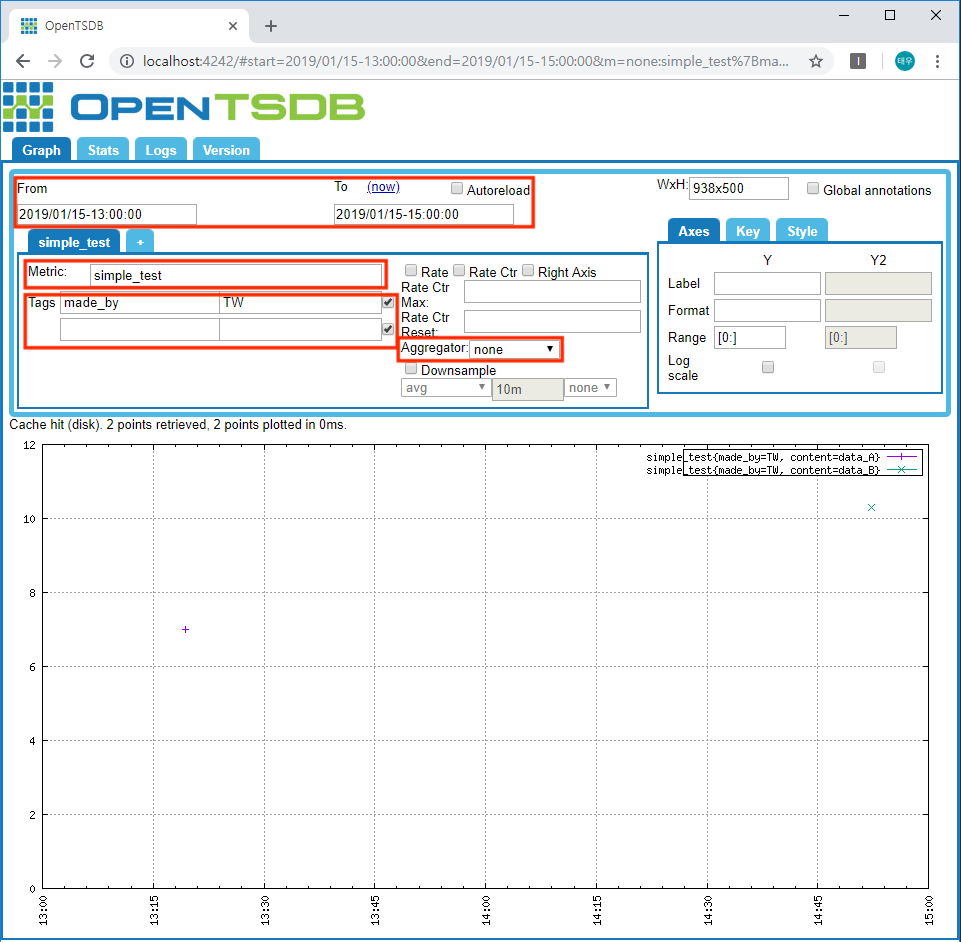

이 문서에서는 설치된 OpenTSDB를 실행하는 방법부터 HTTP API를 이용한 데이터 입력하고, 입력한 데이터를 OpenTSDB web UI를 이용하여 확인하는 방법까지 설명한다.

이 문서는 기본적으로 [OpenTSDB Document](http://opentsdb.net/docs/build/html/index.html#)를 참고하여 작성하였다. 또한 Linux 배포판 중의 하나인 Ubuntu를 기준으로 작성하였다. 실행코드는 python2를 기준으로 작성하였다.


## [ OpenTSDB 실행 ]

설치된 OpenTSDB를 실행시키기 전에는 무조건 hbase_start.sh 쉘스크립트를 이용하여 HBase를 먼저 실행시켜야 한다. HBase를 동작시킨 뒤, 약 10초 정도 뒤에 OpenTSDB를  실행시키면 된다. 참고로 HBase와 OpenTSDB를 실행시킬때는 sudo 권한을 주고 실행시켜야 한다.
<br/><br/>

HBase가 설치되어있는 폴더 내의 bin/ 폴더를 보면 hbase_start.sh 쉘스크립트가 있다. 필자의 경우에는 아래와 같이 HBase를 실행시킨다. HBase를 실행시켰을 때, 아래와 같은 모습이 나오면 성공적으로 실행된 것이다.

```
cd /usr/local/hbase/hbase-2.1.2/bin
sudo /usr/local/hbase/hbase-2.1.2/bin/start-hbase.sh
```


HBase를 실행시켰다면, 이제 opentsdb 폴더 내의 build/ 폴더로 이동하여 OpenTSDB를 실행시킨다. 필자의 경우에는 아래와 같이 OpenTSDB를 실행시킨다. 참고로 --config 인자에는 opentsdb의 설정파일인 opentsdb.conf 파일의 위치를 지정해준다. 명령어 입력 후 아래의 사진처럼 맨 아래에 ‘Ready to Serve on …’ 이라는 문구가 나오고 커서가 정지해 있다면 정상적으로 OpenTSDB가 구동된 것이다.

```
cd /usr/local/opentsdb/build
sudo /usr/local/opentsdb/build/tsdb tsd --config=/usr/local/opentsdb/src/opentsdb.conf
```


## [ Writing Data ]

OpenTSDB에 데이터를 입력하는 방법은 크게 3가지가 있다. 첫 번째는 Telnet API를 이용하는 것, 두 번째는 HTTP API를 이용하는 것, 세 번째는 file을 이용하여 batch import를 하는 것이다. 그러나 'Telnet API를 이용'하거나 'file을 이용하여 batch import(결국 Telnet API를 이용하는 방법임)'를 하는 것은 formatting 에러나 storage 에러가 일어나서 데이터 쓰기에 실패한 데이터를 판별할 수 없다. 따라서 [OpenTSDB Docunment - Writing Data](http://opentsdb.net/docs/build/html/user_guide/writing/index.html#input-methods)에서도 HTTP API를 이용하는 것을 권장한다.
<br/><br/>

여러개의 데이터를 입력할 때, request 당 데이터 포인트 수를 정해놓고 입력하는 것이 좋다. 너무 많은 데이터 포인트를 한번에 보내게 되면 request에 대한 응답을 받는데 시간이 오래 걸리기 때문이다. OpenTSDB Document - /api/put 에서는 request 당 50개의 데이터 포인트씩 보내는 것을 추천한다. 이 request 당 데이터 포인트 수는 컴퓨팅 리소스와 설정에 따라 달라질 수 있으니, 상황에 맞게 조절해서 쓰면 된다.
<br/><br/>

### 예제 코드

원래는 위에서 언급한 것처럼 request 당 데이터 포인트 수를 고려하여 코드를 작성해야 한다. 하지만 이 문서에서 다루는 심플 테스트에서는 두 개의 데이터 포인트만을 전송하는 간단한 예제이기 때문에 고려하지 않고 코드를 작성했다는 점을 이해하길 바란다.
<br/><br/>

아래의 코드에서 'TSDB_URL'이라는 변수는 OpenTSDB가 설치되어 있는 주소와 연결된 포트번호를 포함한다. 필자의 경우, 로컬에 포트번호 4242로 OpenTSDB가 연결되어 있으므로 아래와 같이 'http://localhost:4242'로 변수를 지정한 것이다. TSDB_URL을 본인의 상황에 맞게 변경해주고 아래의 코드를 돌렸을 때, 아래의 사진과 같이 Status code가 200 또는 204와 같은 값을 나타내고 빈 Response Content를 나타낼 것이다. 만일 'TSDB_URL'을 잘못 입력했거나, 잘못된 데이터 포인트를 입력했을 때는   다른 Status code 값과 비어있지 않은 Response Content를 나타내게 될 것이다. [자세한 내용은 이곳](http://opentsdb.net/docs/build/html/api_http/index.html#response-codes)을 참고하길 바란다.

```python
import json
import requests
import time
from datetime import datetime

TSDB_URL = 'http://localhost:4242'
METRIC = 'simple_test'

TIME_1 = '2019-01-15 13:19:24'
VALUE_1 = 7
TAGS_1 = {
    'content': 'data_A',
    'made_by': 'TW'
}

TIME_2 = '2019-01-15 14:52:18'
VALUE_2 = 10.3
TAGS_2 = {
    'content': 'data_B',
    'made_by': 'TW'
}

def str_to_timestamp(t_string):
    d_time = datetime.strptime(t_string, '%Y-%m-%d %H:%M:%S')
    timestamp = int(time.mktime(d_time.timetuple()))
    return timestamp

def make_datapoint(metric, time, value, tags):
    dp = dict()
    dp['metric'] = metric
    dp['timestamp'] = str_to_timestamp(time)
    dp['value'] = value
    dp['tags'] = tags
    return dp

def make_puturl(url):
    if url[-1] is '/':
        put_url = url + 'api/put'
    else:
        put_url = url + '/api/put'
    return put_url

def sendbuf(session, url, buf):
    put_url = make_puturl(url)
    print("[URL]: %s" % put_url)
    headers = {'content-typ': 'application/json'}
    response = session.post(put_url, data=json.dumps(buf), headers=headers)
    
    print("[PUT]: \n%s" % (json.dumps(buf, ensure_ascii=False, indent=4)))
    print("[Status Code]: %s" % (response.status_code))
    print("[Response Content]: %s" % (response.content))

    
if __name__ == '__main__':
    buf = []
    dp_1 = make_datapoint(METRIC, TIME_1, VALUE_1, TAGS_1)
    dp_2 = make_datapoint(METRIC, TIME_2, VALUE_2, TAGS_2)
    buf.append(dp_1)
    buf.append(dp_2)
    
    with requests.Session() as s:
        sendbuf(s, TSDB_URL, buf)
```


## [ Querying Data with OpenTSDB web UI]

데이터 쿼리하는 것 역시 HTTP API를 이용하여 코드 상에서 데이터를 다루는 방법이 있지만, 추후에 다른 문서에서 다루려고 한다. 왜냐하면 쿼리에 대한 내용만 해도 양이 상당하기 때문이다.. 그래서 이 문서에서는 간단하게 OpenTSDB web UI를 이용하여 위의 [ Writing Data ] 예제 코드에서 입력한 데이터를 확인해보도록 하자.
<br/><br/>

먼저 OpenTSDB web UI를 살펴보면 아래의 사진과 같다. 이러한 OpenTSDB web UI에 접속하는 방법 역시 위의 예제 코드에서 설명한 'TSDB_URL'과 마찬가지로 OpenTSDB가 설치되어 있는 주소와 연결된 포트번호를 포함한다. 필자의 경우, 로컬에 포트번호 4242로 OpenTSDB가 연결되어 있으므로 아래와 같이 [http://localhost:4242](http://localhost:4242)로 접속하면 OpenTSDB web UI를 이용할 수 있다.


### 데이터 확인

워낙 OpenTSDB web UI가 잘 구성되어 있어서 각각의 input란에 어떠한 사항을 입력해야 하는지는 직관적으로 알 수 도 있을 것이다. 그래도 위의 [ Writing Data ] 예제 코드에서 입력한 데이터를 이용해서 간단히 설명을 해보려고 한다.
<br/><br/>

일단 위의 [ Writing Data ] 예제 코드에서 입력했던 두개의 dp(data point) 정보를 다시 한 번 확인해보면 아래의 사진과 같다. 참고로 timestamp 값인 '1547525964'와 '1547531538'은 각각 한국 표준시(KST)를 기준으로 '2019-01-15 13:19:24'와 '2019-01-15 14:52:18'이 된다.


#### 예제-1

위의 두 데이터를 하나의 그래프로 확인하려면 아래의 사진처럼 input란에 입력을 해주면 된다. From과 To란에는 각각 쿼리하려는 데이터의 시작 시간과 끝 시간을 적어주면 된다. 참고로, OpenTSDB에서 쿼리할 때는 시작과 끝 순간을 모두 포함한다(From 이상 ~ To 이하 시간의 모든 데이터).
<br/><br/>

그리고 쿼리하려는 Metric 이름과 Tag 정보를 입력해준다. [ Writing Data ] 예제 코드에서 입력한 데이터에서 알 수 있는 것처럼 Metric 이름과 Tags 정보중 'made_by' 키에 대한 값이 같다. 따라서 두 가지 데이터를 한번에 쿼리하려면 아래와 같이 공통된 tag 정보만 입력해주면 된다. 마지막으로 두 데이터 포인터를 하나의 그래프로서 보고싶다면 Aggregator를 sum으로 지정해주면 된다.
<br/><br/>

~~이후에 쿼리에 대한 내용에 대하여 다룰 때 더 자세히 다루겠지만, sum이라는 Aggregator를 설정하게 되면 단순히 하나의 그래프로 묶어서 보여주는 것이 아니라 같은 timestamp에 해당하는 값이 있을 때 두 값을 더해서 나타내준다. 지금은 완전히 이해 못하더라도 좋으니, 그냥 그렇더라 하고 넘어가는 것도 좋다.~~ 


#### 예제-2

위의 예제-1 그래프와 다른 점은 다 같지만 Aggregator를 none으로 설정해주면 구체적으로 Tag 정보를 지정하지 않았더라도 쿼리 조건에 해당하는 데이터들을 구체적인 Tag 정보에 따라 각각 나타내 준다. 아래의 사진을 보면 위의 예제-1과는 달리 하나의 이어진 그래프가 아니라 각각 다른 색깔인 하나의 점으로 나타난 것을 확인할 수 있다.



#### 예제-3

이제 구체적인 Tag 정보를 모두 입력하여 각각 하나의 데이터 포인트씩 확인해보려고 한다. 이때 추가적으로 Range 범위를 '[0:]에서 [:]으로' 변경했는데, 이는 단순히 시각적으로 보기 편하게 하기 위함이다. 만약 기존과 똑같이 [0:]으로 두었다면 점이 맨 위의 선에 찍히게 되어 식별하기 어렵기 때문이다.
<br/><br/>

구체적인 Tag정보인 'content'키에 대한 값을 'data_A'로 입력하여 쿼리해주면 아래와 같다.


<br/>

마찬가지로 이번엔 구체적인 Tag정보인 'content'키에 대한 값을 'data_B'로 입력하여 쿼리해주면 아래와 같다.

