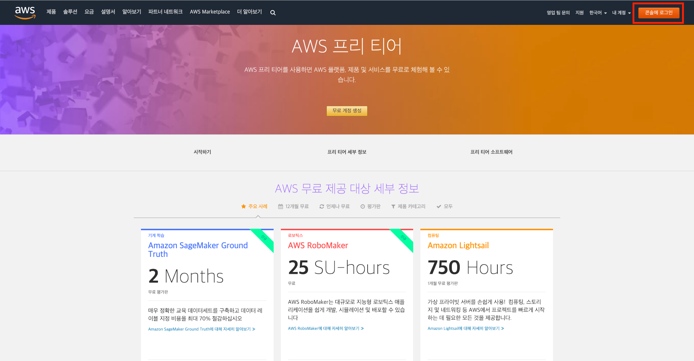
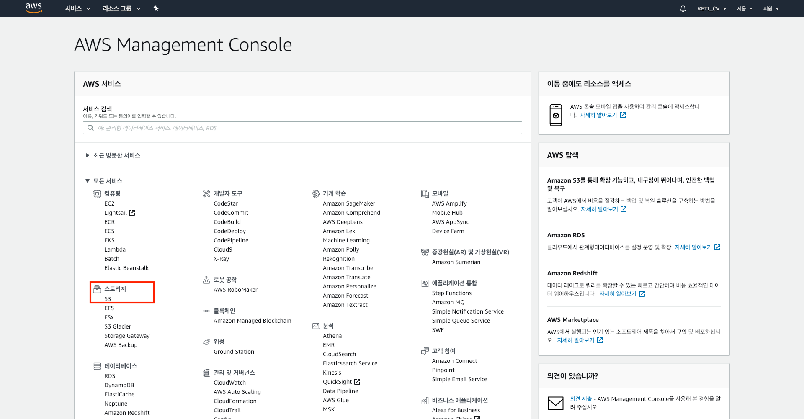
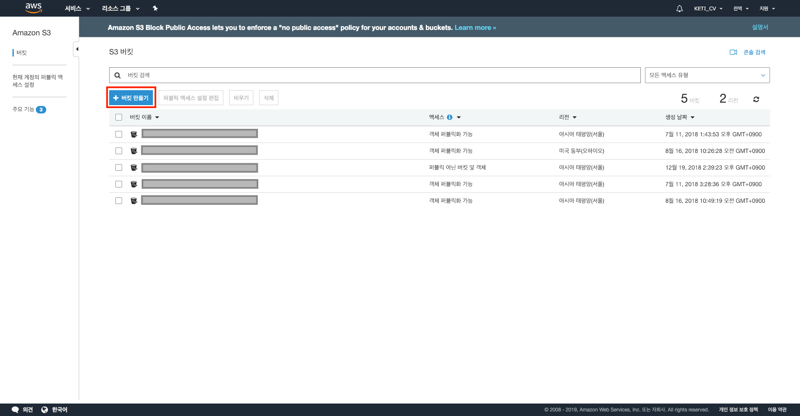
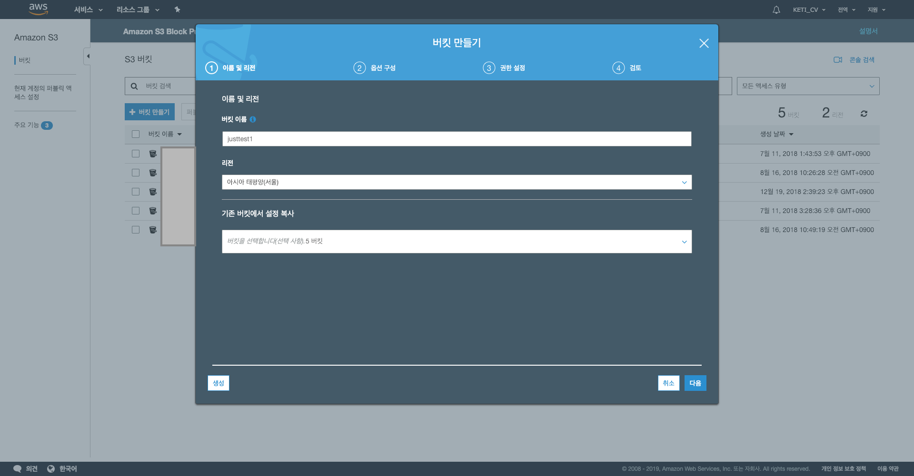
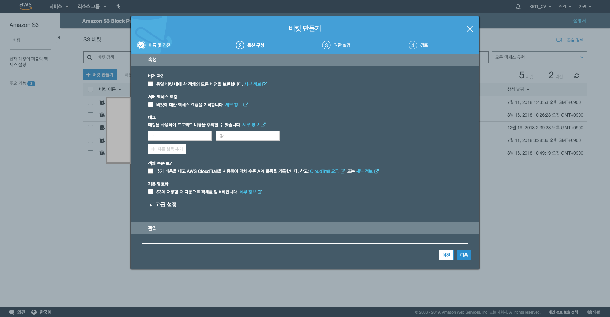
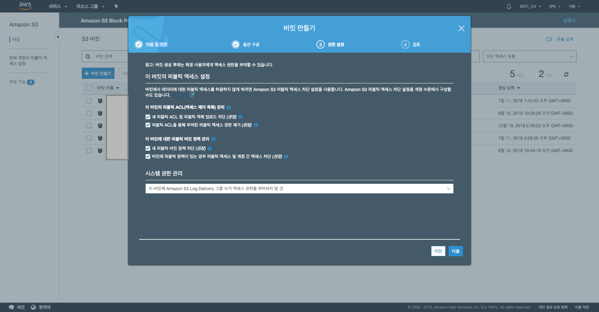
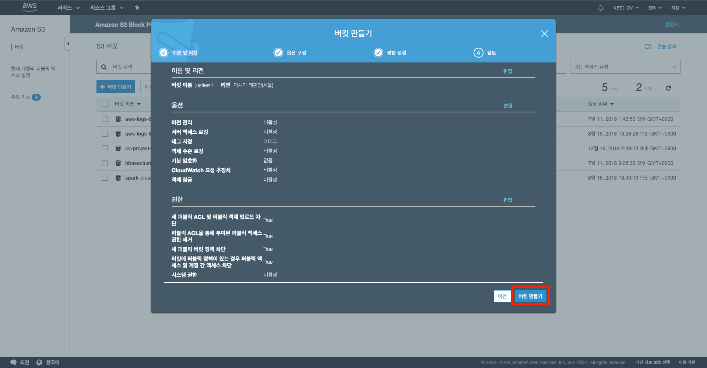
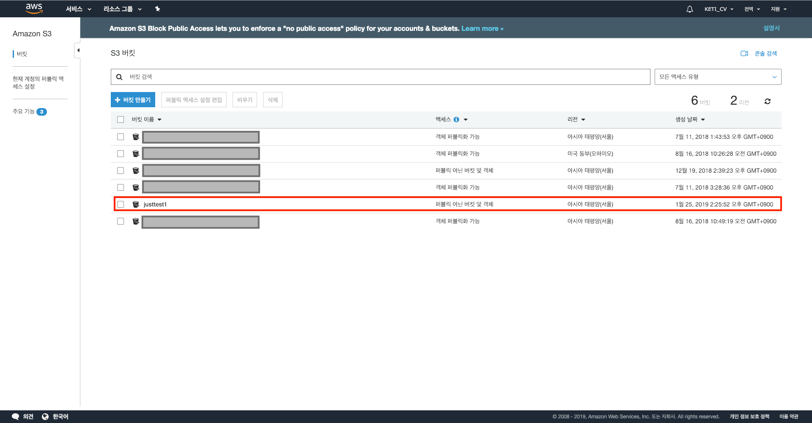

이 문서에서는 AWS(Amazon Web Services)에서 S3 기반으로 HBase를 구축하는 방법부터 그 위에 OpenTSDB를 설치하는 방법까지 설명한다.

이 문서는 기본적으로 [HBase on Amazon S3 (Amazon S3 Storage Mode)](https://docs.aws.amazon.com/emr/latest/ReleaseGuide/emr-hbase-s3.html)를 참고하여 작성하였다. 또한 이 문서에 포함되어 있는 AWS 스크린샷은 작성일(2019-01-25)을 기준의 상태이므로 참고하길 바란다.

## [ HBase 환경 구축 및 부트스트랩 작업을 통한 OpenTSDB 설치 ] 

AWS에서는 Amazon EMR을 통해 HBase를 사용할 수 있다. 그리고 Amazon EMR 버전 5.2.0 이상에서 HBase 실행할 경우 Amazon S3 기반 HBase를 활성화할 수 있다. HDFS가 아닌 S3를 기반으로 HBase를 구축하게 되면 속도는 느리겠지만, 비용 측면에서는 많은 절감을 이룰 수 있다. 이외에도 더 구체적인 Amazon S3 기반 HBase 환경의 장점은 [HBase on Amazon S3 (Amazon S3 Storage Mode)](https://docs.aws.amazon.com/emr/latest/ReleaseGuide/emr-hbase-s3.html)에서 자세히 확인할 수 있다.

### 1. Amazon S3에서 새로운 버킷 생성하기

Amazon S3(Simple Storage Service)를 생성하기 위해 우선 AWS 페이지에서 콘솔에 로그인을 한다.

 

콘솔에 로그인을 하게 되면 아래의 사진과 같은 콘솔 페이지가 나오는데, 스토리지란에 있는 S3를 클릭한다.

 

S3를 클릭하면 아래와 같은 페이지가 나오는데, 버킷 만들기 버튼을 누른다.

 

버킷 만들기 버튼을 누르면 아래의 사진과 같은 1번 이름 및 리전 창이 뜨는데, 버킷 이름과 S3 스토리지가 생성될 리전(위치)을 설정할 수 있다. 필자의 경우는 버킷 이름을 justtest1 으로 그리고 리전은 아시아 태평양(서울)로 설정하였다.

 

버킷의 이름 및 리전을 설정하고 다음 버튼을 누르면 아래의 사진과 같이 S3에 관련된 각종 옵션을 선택할 수 있는 2번 옵션 구성 창으로 넘어가는데, 이 문서에서는 구체적인 설정이 필요없으므로 그냥 아무것도 수정하지 않고 디폴트 값으로 다음 버튼을 누른다. (여기에 있는 옵션들은 후에 버킷을 완전히 생성하고 나서도 충분히 변경 가능하다.)

 

다음 버튼을 눌러서 3번 권한 설정으로 가면, 아래와 같은 3번 권한 설정 창으로 넘어간다. 이 창은 미리 정의된 그룹 내에서 S3 버킷에 대한 각종 권한들을 정의 하는 창으로, 이 문서에서는 디폴트 값인 권장 설정 값 그대로 다음 버튼을 누른다.

 

이제 마지막으로 4번 검토 창에서는 현재까지 설정했던 사항들에 대하여 검토 할 수 있는 창이 뜬다. 사실상 현재까지 설정한 것 중에서 버킷 이름과 리전만 설정했을 뿐 다른 것은 디폴트 값 또는 권장 설정 값으로 지저했기 때문에, 본인이 설정한 버킷 이름과 리전 위치가 맞다고 확인했으면 버킷 만들기 버튼을 눌러서 버킷을 생성한다.

 

그렇다면 이제 창에 새로운 버킷이 생성된 것을 확인 할 수 있다.

### 2. Amazon EMR에서 새로운 인스턴스 생성

이제 S3 버킷을 생성했으니, Amazon EMR로 HBase 환경을 구축해보자. 참고로 Amazon EMR에서 새로운 인스턴스를 생성할 때, 부트스트랩 작업을 사용하여 추가 소프트웨어를 설치하거나 클러스터 인스턴스의 구성을 사용자 지정할 수 있다. 이 문서에서는 새로운 EMR 인스턴스를 생성할 때 지정할 수 있는 부트스트랩 작업을 통해 OpenTSDB를 설치할 것이다.
  

우선 EMR에서 S3 스토리지 모드로 설정한 HBase 환경을 구축하기 위해서는 S3 버킷에 HBase의 루트 디렉토리가 필요하다.

작성중..

## [ OpenTSDB 설정 및 간단한 테스트 ]

### 1. OpenTSDB 설치 및 설정

작성중..

### 2. OpenTSDB Check

작성중..
