이 문서에서는 AWS(Amazon Web Services)에서 S3 기반으로 HBase를 구축하는 방법부터 그 위에 OpenTSDB를 설치하는 방법까지 설명한다.

이 문서는 기본적으로 [HBase on Amazon S3 (Amazon S3 Storage Mode)](https://docs.aws.amazon.com/emr/latest/ReleaseGuide/emr-hbase-s3.html)를 참고하여 작성하였다. 또한 이 문서에 포함되어 있는 AWS 스크린샷은 작성일(2019-01-25)을 기준의 상태이므로 참고하길 바란다.


## [ HBase 환경 구축 및 부트스트랩 작업을 통한 OpenTSDB 설치 ] 

AWS에서는 Amazon EMR을 통해 HBase를 사용할 수 있다. 그리고 Amazon EMR 버전 5.2.0 이상에서 HBase 실행할 경우 Amazon S3 기반 HBase를 활성화할 수 있다. HDFS가 아닌 S3를 기반으로 HBase를 구축하게 되면 속도는 느리겠지만, 비용 측면에서는 많은 절감을 이룰 수 있다. 이외에도 더 구체적인 Amazon S3 기반 HBase 환경의 장점은 [HBase on Amazon S3 (Amazon S3 Storage Mode)](https://docs.aws.amazon.com/emr/latest/ReleaseGuide/emr-hbase-s3.html)에서 자세히 확인할 수 있다.

### 1. Amazon S3에서 새로운 버킷 생성하기

Amazon S3(Simple Storage Service)를 생성하기 위해 우선 AWS 페이지에서 콘솔에 로그인을 한다.


<br/>

콘솔에 로그인을 하게 되면 아래의 사진과 같은 콘솔 페이지가 나오는데, 스토리지란에 있는 S3를 클릭한다.


<br/>

S3를 클릭하면 아래와 같은 페이지가 나오는데, 버킷 만들기 버튼을 누른다.


<br/>

버킷 만들기 버튼을 누르면 아래의 사진과 같은 1번 이름 및 리전 창이 뜨는데, 버킷 이름과 S3 스토리지가 생성될 리전(위치)을 설정할 수 있다. 필자의 경우는 버킷 이름을 justtest1 으로 그리고 리전은 아시아 태평양(서울)로 설정하였다.


<br/>

버킷의 이름 및 리전을 설정하고 다음 버튼을 누르면 아래의 사진과 같이 S3에 관련된 각종 옵션을 선택할 수 있는 2번 옵션 구성 창으로 넘어가는데, 이 문서에서는 구체적인 설정이 필요없으므로 그냥 아무것도 수정하지 않고 디폴트 값으로 다음 버튼을 누른다. (여기에 있는 옵션들은 후에 버킷을 완전히 생성하고 나서도 충분히 변경 가능하다.)


<br/>

다음 버튼을 눌러서 3번 권한 설정으로 가면, 아래와 같은 3번 권한 설정 창으로 넘어간다. 이 창은 미리 정의된 그룹 내에서 S3 버킷에 대한 각종 권한들을 정의 하는 창으로, 이 문서에서는 디폴트 값인 권장 설정 값 그대로 다음 버튼을 누른다.


<br/>

이제 마지막으로 4번 검토 창에서는 현재까지 설정했던 사항들에 대하여 검토 할 수 있는 창이 뜬다. 사실상 현재까지 설정한 것 중에서 버킷 이름과 리전만 설정했을 뿐 다른 것은 디폴트 값 또는 권장 설정 값으로 지저했기 때문에, 본인이 설정한 버킷 이름과 리전 위치가 맞다고 확인했으면 버킷 만들기 버튼을 눌러서 버킷을 생성한다.


<br/>

그렇다면 이제 창에 새로운 버킷이 생성된 것을 확인 할 수 있다.


### 2. Amazon EMR에서 새로운 인스턴스 생성

이제 S3 버킷을 생성했으니, Amazon EMR로 HBase 환경을 구축해보자. 참고로 Amazon EMR에서 새로운 인스턴스를 생성할 때, 부트스트랩 작업을 사용하여 추가 소프트웨어를 설치하거나 클러스터 인스턴스의 구성을 사용자 지정할 수 있다. 이 문서에서는 새로운 EMR 인스턴스를 생성할 때 지정할 수 있는 부트스트랩 작업을 통해 OpenTSDB를 설치할 것이다.


#### 2.1 S3 버킷에 루트 디렉토리 생성

우선 EMR에서 S3 스토리지 모드로 설정한 HBase 환경을 구축하기 위해서는 S3 버킷에 HBase의 루트 디렉토리가 필요하다. HBase 환경을 위한 루트 디렉토리를 설정하기 위해 새로 생성한 S3 버킷을 클릭하여 들어가보자. 필자의 경우 justtest1 이라는 버킷을 클릭하여 들어갔고, 아래의 사진과 같은 페이지가 열렸다. 그리고 루트 디렉토리를 만들기 위해 아래의 페이지에서 폴더 만들기 버튼을 클릭한다.

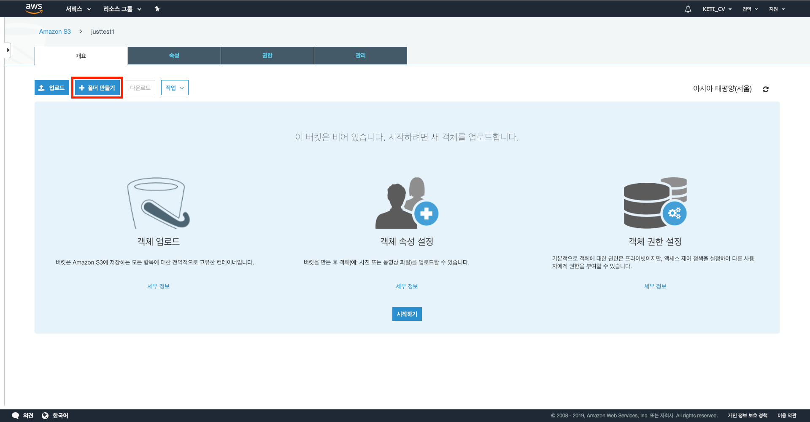

<br/>

폴더 만들기 버튼을 클릭하면 아래의 사진과 같은 페이지가 뜨는데, 만들 폴더의 이름을 입력해주고 저장 버튼을 누른다. 필자의 경우 rootdir이라 입력하였다.

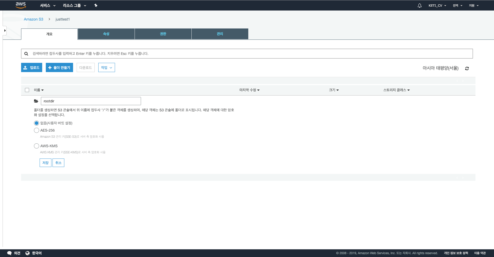

<br/>

그러면 아래의 사진과 같이 새로운 디렉토리가 생성된 모습을 확인할 수 있다.

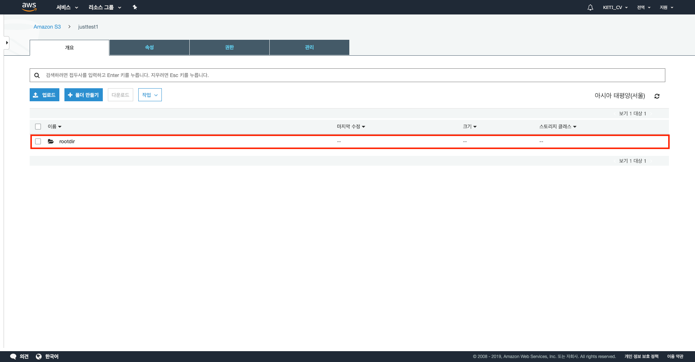


#### 2.2 부트스트랩 작업을 위한 OpenTSDB 설치 스크립트 받기
앞에서도 얘기했던 것처럼 부트스트랩 작업을 통해 OpenTSDB를 설치하려면 부트스트랩 스크립트가 있어야 한다. 필자는 이 스크립트를 아래의 페이지에서 구할 수 있었다. ~~사랑해요 깃허브, 위아더월드!~~

\<reference\> :<br/>
[https://github.com/aws-samples/emr-bootstrap-actions/blob/master/opentsdb/install-opentsdb.sh](https://github.com/aws-samples/emr-bootstrap-actions/blob/master/opentsdb/install-opentsdb.sh)

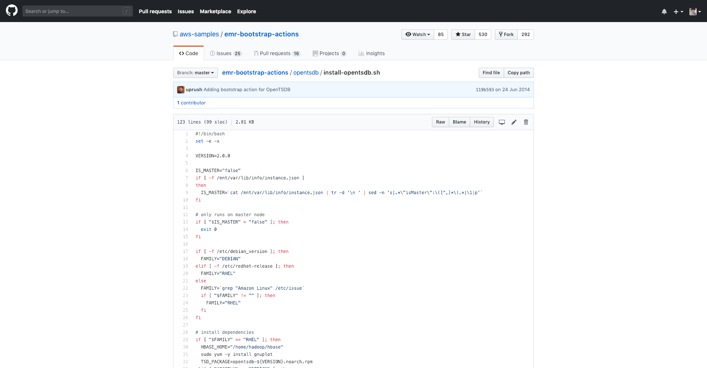

<br/>

다만 우리의 현재 상황에 맞게 바꿔야할 사항들이 몇 가지가 있다. 우선 2018년 12월 16일을 기점으로 OpenTSDB 2.4.0 버전이 release 되었으므로, 사용자가 원하는 버전에 맞게 VERSION을 고쳐주어야 한다. 그리고 별도의 설정을 하지 않는 이상 EMR에는 Redhat 계열의 리눅스가 설치되고, 그 환경 아래에 설치된 HBase는 "/usr/lib/hbase" 위치에 설치되므로 HBASE_HOME의 위치를 이에 맞게 바꿔주어야 한다.

```
#!/bin/bash
#
#
# <reference> -- https://github.com/aws-samples/emr-bootstrap-actions/blob/master/opentsdb/install-opentsdb.sh
#
#
#

set -e -x

VERSION=2.4.0

IS_MASTER="false"
if [ -f /mnt/var/lib/info/instance.json ]
then
  IS_MASTER=`cat /mnt/var/lib/info/instance.json | tr -d '\n ' | sed -n 's|.*\"isMaster\":\([^,]*\).*|\1|p'`
fi

# only runs on master node
if [ "$IS_MASTER" = "false" ]; then
  exit 0
fi

if [ -f /etc/debian_version ]; then
  FAMILY="DEBIAN"
elif [ -f /etc/redhat-release ]; then
  FAMILY="RHEL"
else
  FAMILY=`grep "Amazon Linux" /etc/issue`
  if [ "$FAMILY" != "" ]; then
    FAMILY="RHEL"
  fi
fi

# install dependencies
if [ "$FAMILY" == "RHEL" ]; then
  HBASE_HOME="/usr/lib/hbase"
  sudo yum -y install gnuplot
  TSD_PACKAGE=opentsdb-${VERSION}.noarch.rpm
elif [ "$FAMILY" == "DEBIAN" ]; then
  HBASE_HOME="/home/hadoop"
  sudo apt-get update
  sudo apt-get -y install gnuplot
  TSD_PACKAGE=opentsdb-${VERSION}_all.deb
else
  echo "Unsupported platform."
  exit 1
fi
TSD_DOWNLOAD=https://github.com/OpenTSDB/opentsdb/releases/download/v${VERSION}/${TSD_PACKAGE}

# download the package and install it
cd /home/hadoop
wget --no-check-certificate $TSD_DOWNLOAD
if [ "$FAMILY" == "RHEL" ]; then
  sudo rpm -ivh $TSD_PACKAGE
else
  sudo dpkg -i $TSD_PACKAGE
fi
rm $TSD_PACKAGE

# configure tsd
TSD_HOME=/home/hadoop/opentsdb
mkdir -p $TSD_HOME

TSD_INSTALL=/usr/share/opentsdb

# Set tsdb command permission
sudo chmod 755 $TSD_INSTALL/bin/tsdb

# cron to clean the cache directory
cat <<-EOF > $TSD_HOME/clean_cache.sh
#!/bin/bash
sudo /usr/share/opentsdb/tools/clean_cache.sh
EOF
chmod 755 $TSD_HOME/clean_cache.sh
sudo cp $TSD_HOME/clean_cache.sh /etc/cron.daily/

# create a simple script to collect metrics from tsd itself
cat <<-EOF > $TSD_HOME/tsdb-status.sh
#!/bin/bash
echo stats \
 | nc -w 1 localhost 4242 \
 | sed 's/^/put /' \
 | nc -w 1 localhost 4242
EOF

chmod 755 $TSD_HOME/tsdb-status.sh

# Write the TSD start_and_configure script.
cat <<-EOF > $TSD_HOME/start_and_configure_tsd.sh
#!/bin/bash
#
# Only run this script once to initialize TSD.
#
echo "Initializing TSD..."
# check zookeeper connectivity
RUOK=\`echo ruok | nc -w 5 localhost 2181\`
if [ "\$RUOK" != "imok" ]; then
  echo "Cannot connect to Zookeeper."
  exit 1
fi
# create tables
COMPRESSION=LZO HBASE_HOME=$HBASE_HOME $TSD_INSTALL/tools/create_table.sh
# start TSD
sudo /etc/init.d/opentsdb start

echo "Completed initializing TSD."
echo "Check the TSD web UI at http://localhost:4242/"
EOF

chmod +x $TSD_HOME/start_and_configure_tsd.sh

echo "Completed OpenTSDB setup."
echo "Run once $TSD_HOME/start_and_configure_tsd.sh to initialize TSD."
```

위의 스크립트를 복사해서 붙여넣은 쉘스크립트 파일(*.sh)로 만든다.

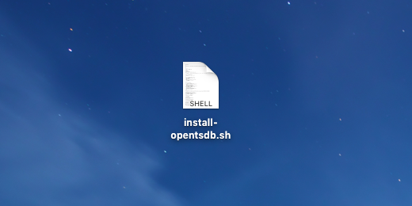

그 다음 버킷에 업로드 버튼을 누르고, 파일 추가를 하여 OpenTSDB를 설치하는 부트스트랩 작업 쉘스크립트를 업로드 한다.

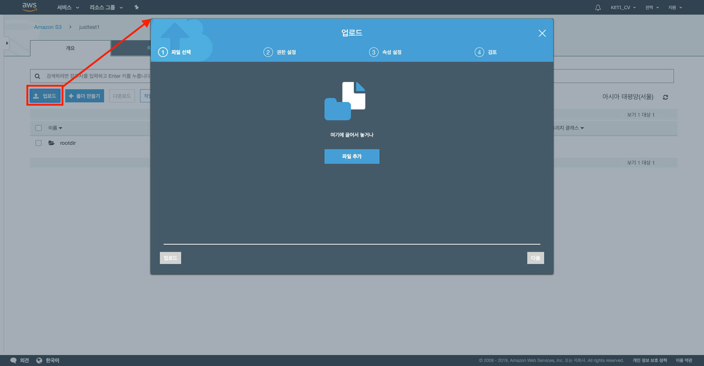

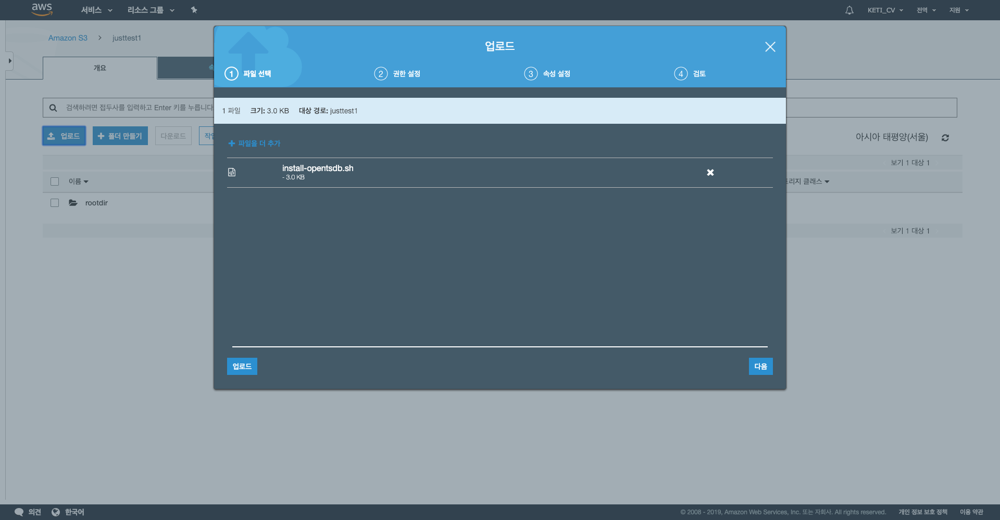

<br/>

다음은 이 파일에 대한 권한을 설정하는 창이다. 이 창에서 업로드할 파일에 대한 권한을 설정해준다. 필자의 경우 다음 그림과 같이 default 값 그대로 두었다.

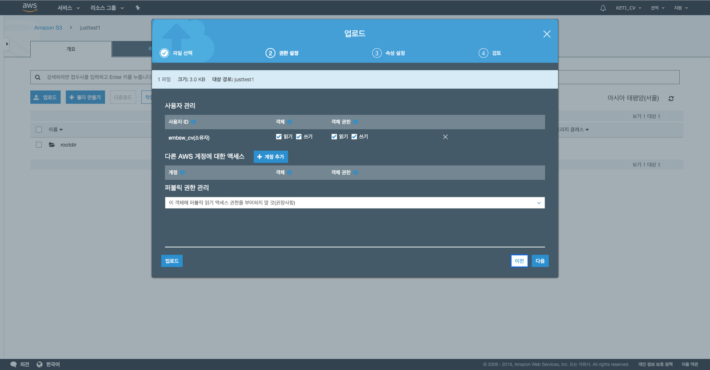

<br/>

다음은 스토리지 클래스를 정하는 창인데, 부트스트랩 작업 쉘스크립트는 처음 EMR을 설정할 때만 필요하므로 default 값인 최소 스토리지 기간이 없는 스탠다드 클래스를 선택하여 넘어간다.

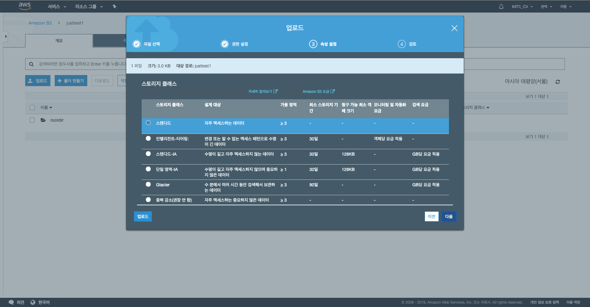

<br/>

마지막으로 지금까지 정한 업로드 설정을 마지막으로 검토해 보는 창을 통해 확인해보고 업로드 버튼을 누른다.

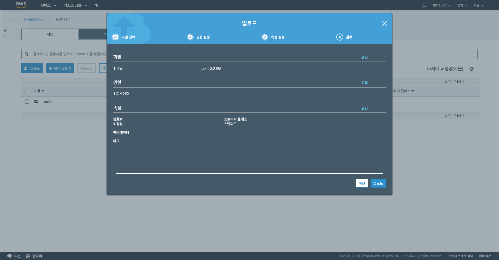

<br/>

그럼 이제 부트스트랩 작업 쉘스크립트인 install-opentsdb.sh 파일이 S3 버킷에 업로드 된 것을 확인할 수 있다.

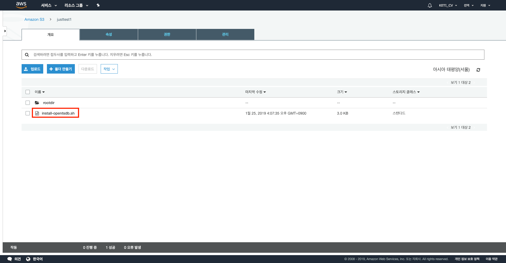


#### 2.3 SSH를 위한 키 페어 생성
생성한 EMR 인스턴스를 서버처럼 사용하기 위해서는 SSH 접속을 해야하는데, 이를 위해서는 키 페어 생성이 필요하다. (~~왜이렇게 해야할게 많은 것인지는 모르겠지만, 이게 마지막 준비단계이니 조금만 더 참고 가보자~~)


#### 2.4 EMR 인스턴스 생성하기
앞에서 EMR 인스턴스를 

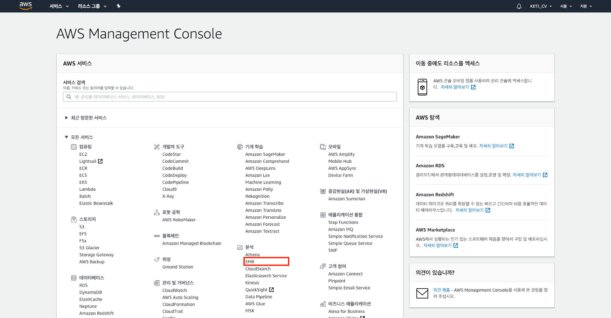

작성중...

## [ OpenTSDB 설정 및 간단한 테스트 ]


### 1. OpenTSDB 설치 및 설정

작성중..

### 2. OpenTSDB Check

작성중..
