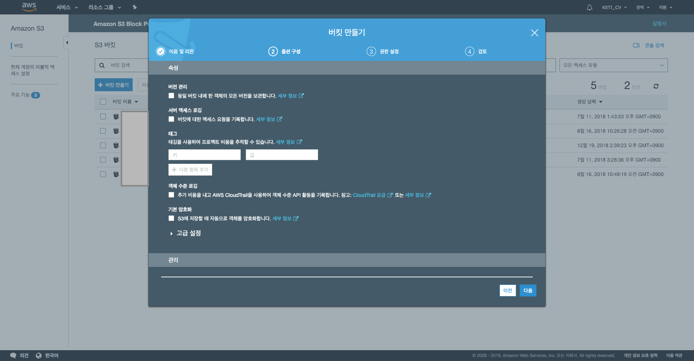
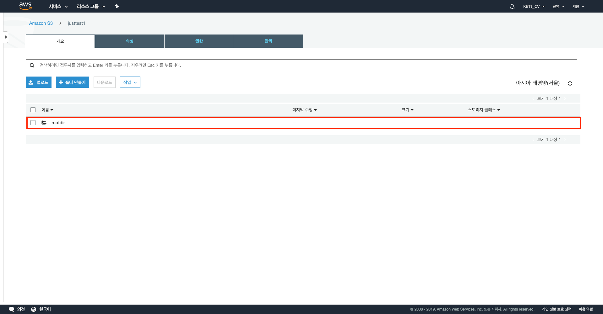
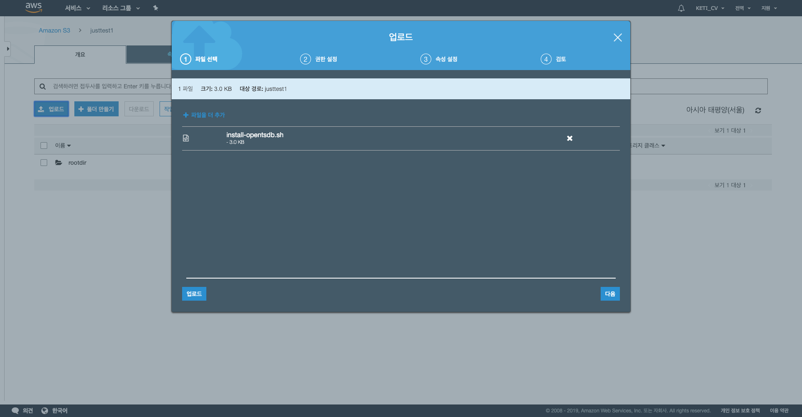
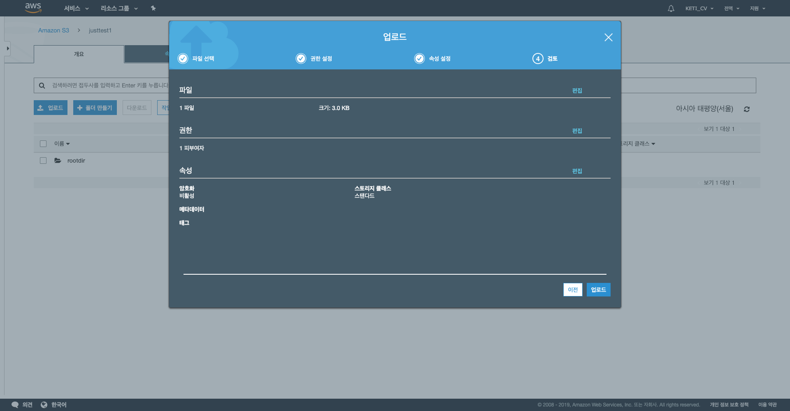
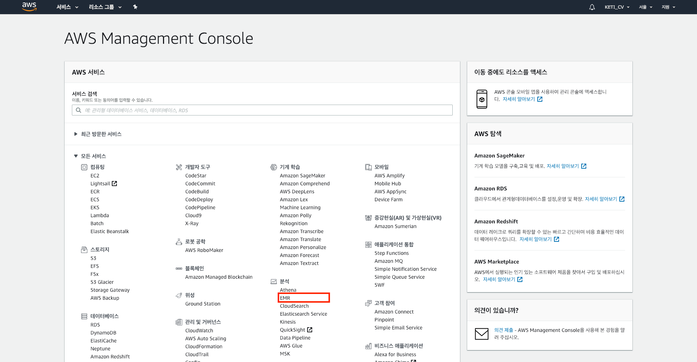

이 문서에서는 AWS(Amazon Web Services)에서 S3 기반으로 HBase를 구축하는 방법부터 그 위에 OpenTSDB를 설치하는 방법까지 설명한다.

이 문서는 기본적으로 [HBase on Amazon S3 (Amazon S3 Storage Mode)](https://docs.aws.amazon.com/emr/latest/ReleaseGuide/emr-hbase-s3.html)를 참고하여 작성하였다. 또한 이 문서에 포함되어 있는 AWS 스크린샷은 작성일(2019-02-03)을 기준의 상태이므로 참고하길 바란다.


## [ HBase 환경 구축 및 부트스트랩 작업을 통한 OpenTSDB 설치 ] 

AWS에서는 Amazon EMR을 통해 HBase를 사용할 수 있다. 그리고 Amazon EMR 버전 5.2.0 이상에서 HBase 실행할 경우 Amazon S3 기반 HBase를 활성화할 수 있다. HDFS가 아닌 S3를 기반으로 HBase를 구축하게 되면 속도는 느리겠지만, 비용 측면에서는 많은 절감을 이룰 수 있다. 이외에도 더 구체적인 Amazon S3 기반 HBase 환경의 장점은 [HBase on Amazon S3 (Amazon S3 Storage Mode)](https://docs.aws.amazon.com/emr/latest/ReleaseGuide/emr-hbase-s3.html)에서 자세히 확인할 수 있다.

### 1. Amazon S3에서 새로운 버킷 생성하기

Amazon S3(Simple Storage Service)를 생성하기 위해 우선 AWS 페이지에서 콘솔에 로그인을 한다.


<br/>

콘솔에 로그인을 하게 되면 아래의 사진과 같은 콘솔 페이지가 나오는데, 스토리지란에 있는 S3를 클릭한다.


<br/>

S3를 클릭하면 아래와 같은 페이지가 나오는데, 버킷 만들기 버튼을 누른다.


<br/>

버킷 만들기 버튼을 누르면 아래의 사진과 같은 1번 이름 및 리전 창이 뜨는데, 버킷 이름과 S3 스토리지가 생성될 리전(위치)을 설정할 수 있다. 필자의 경우는 버킷 이름을 justtest1 으로 그리고 리전은 아시아 태평양(서울)로 설정하였다.


<br/>

버킷의 이름 및 리전을 설정하고 다음 버튼을 누르면 아래의 사진과 같이 S3에 관련된 각종 옵션을 선택할 수 있는 2번 옵션 구성 창으로 넘어가는데, 이 문서에서는 구체적인 설정이 필요없으므로 그냥 아무것도 수정하지 않고 디폴트 값으로 다음 버튼을 누른다. (여기에 있는 옵션들은 후에 버킷을 완전히 생성하고 나서도 충분히 변경 가능하다.)



<br/>

다음 버튼을 눌러서 3번 권한 설정으로 가면, 아래와 같은 3번 권한 설정 창으로 넘어간다. 이 창은 미리 정의된 그룹 내에서 S3 버킷에 대한 각종 권한들을 정의 하는 창으로, 이 문서에서는 디폴트 값인 권장 설정 값 그대로 다음 버튼을 누른다.


<br/>

이제 마지막으로 4번 검토 창에서는 현재까지 설정했던 사항들에 대하여 검토 할 수 있는 창이 뜬다. 사실상 현재까지 설정한 것 중에서 버킷 이름과 리전만 설정했을 뿐 다른 것은 디폴트 값 또는 권장 설정 값으로 지저했기 때문에, 본인이 설정한 버킷 이름과 리전 위치가 맞다고 확인했으면 버킷 만들기 버튼을 눌러서 버킷을 생성한다.


<br/>

그렇다면 이제 창에 새로운 버킷이 생성된 것을 확인 할 수 있다.


### 2. Amazon EMR에서 새로운 클러스터 생성

이제 S3 버킷을 생성했으니, Amazon EMR로 HBase 환경을 구축해보자. 참고로 Amazon EMR에서 새로운 클러스터를 생성할 때, 부트스트랩 작업을 사용하여 추가 소프트웨어를 설치하거나 클러스터의 구성을 사용자 지정할 수 있다. 이 문서에서는 새로운 EMR 클러스터를 생성할 때 지정할 수 있는 부트스트랩 작업을 통해 OpenTSDB를 설치할 것이다.


#### 2.1 S3 버킷에 루트 디렉토리 생성

우선 EMR에서 S3 스토리지 모드로 설정한 HBase 환경을 구축하기 위해서는 S3 버킷에 HBase의 루트 디렉토리가 필요하다. HBase 환경을 위한 루트 디렉토리를 설정하기 위해 새로 생성한 S3 버킷을 클릭하여 들어가보자. 필자의 경우 justtest1 이라는 버킷을 클릭하여 들어갔고, 아래의 사진과 같은 페이지가 열렸다. 그리고 루트 디렉토리를 만들기 위해 아래의 페이지에서 폴더 만들기 버튼을 클릭한다.


<br/>

폴더 만들기 버튼을 클릭하면 아래의 사진과 같은 페이지가 뜨는데, 만들 폴더의 이름을 입력해주고 저장 버튼을 누른다. 필자의 경우 rootdir이라 입력하였다.


<br/>

그러면 아래의 사진과 같이 새로운 디렉토리가 생성된 모습을 확인할 수 있다.




#### 2.2 부트스트랩 작업을 위한 OpenTSDB 설치 스크립트 받기
앞에서도 얘기했던 것처럼 부트스트랩 작업을 통해 OpenTSDB를 설치하려면 부트스트랩 스크립트가 있어야 한다. 필자는 이 스크립트를 아래의 페이지에서 구할 수 있었다. ~~사랑해요 깃허브, 위아더월드!~~

\<reference\> :<br/>
[https://github.com/aws-samples/emr-bootstrap-actions/blob/master/opentsdb/install-opentsdb.sh](https://github.com/aws-samples/emr-bootstrap-actions/blob/master/opentsdb/install-opentsdb.sh)


<br/>

다만 우리의 현재 상황에 맞게 바꿔야할 사항들이 몇 가지가 있다. 우선 2018년 12월 16일을 기점으로 OpenTSDB 2.4.0 버전이 release 되었으므로, 사용자가 원하는 버전에 맞게 VERSION을 고쳐주어야 한다. 그리고 별도의 설정을 하지 않는 이상 EMR에는 Redhat 계열의 리눅스가 설치되고, 그 환경 아래에 설치된 HBase는 "/usr/lib/hbase" 위치에 설치되므로 HBASE_HOME의 위치를 이에 맞게 바꿔주어야 한다.

```
#!/bin/bash
#
#
# <reference> -- https://github.com/aws-samples/emr-bootstrap-actions/blob/master/opentsdb/install-opentsdb.sh
#
#
#

set -e -x

VERSION=2.4.0

IS_MASTER="false"
if [ -f /mnt/var/lib/info/instance.json ]
then
  IS_MASTER=`cat /mnt/var/lib/info/instance.json | tr -d '\n ' | sed -n 's|.*\"isMaster\":\([^,]*\).*|\1|p'`
fi

# only runs on master node
if [ "$IS_MASTER" = "false" ]; then
  exit 0
fi

if [ -f /etc/debian_version ]; then
  FAMILY="DEBIAN"
elif [ -f /etc/redhat-release ]; then
  FAMILY="RHEL"
else
  FAMILY=`grep "Amazon Linux" /etc/issue`
  if [ "$FAMILY" != "" ]; then
    FAMILY="RHEL"
  fi
fi

# install dependencies
if [ "$FAMILY" == "RHEL" ]; then
  HBASE_HOME="/usr/lib/hbase"
  sudo yum -y install gnuplot
  TSD_PACKAGE=opentsdb-${VERSION}.noarch.rpm
elif [ "$FAMILY" == "DEBIAN" ]; then
  HBASE_HOME="/home/hadoop"
  sudo apt-get update
  sudo apt-get -y install gnuplot
  TSD_PACKAGE=opentsdb-${VERSION}_all.deb
else
  echo "Unsupported platform."
  exit 1
fi
TSD_DOWNLOAD=https://github.com/OpenTSDB/opentsdb/releases/download/v${VERSION}/${TSD_PACKAGE}

# download the package and install it
cd /home/hadoop
wget --no-check-certificate $TSD_DOWNLOAD
if [ "$FAMILY" == "RHEL" ]; then
  sudo rpm -ivh $TSD_PACKAGE
else
  sudo dpkg -i $TSD_PACKAGE
fi
rm $TSD_PACKAGE

# configure tsd
TSD_HOME=/home/hadoop/opentsdb
mkdir -p $TSD_HOME

TSD_INSTALL=/usr/share/opentsdb

# Set tsdb command permission
sudo chmod 755 $TSD_INSTALL/bin/tsdb

# cron to clean the cache directory
cat <<-EOF > $TSD_HOME/clean_cache.sh
#!/bin/bash
sudo /usr/share/opentsdb/tools/clean_cache.sh
EOF
chmod 755 $TSD_HOME/clean_cache.sh
sudo cp $TSD_HOME/clean_cache.sh /etc/cron.daily/

# create a simple script to collect metrics from tsd itself
cat <<-EOF > $TSD_HOME/tsdb-status.sh
#!/bin/bash
echo stats \
 | nc -w 1 localhost 4242 \
 | sed 's/^/put /' \
 | nc -w 1 localhost 4242
EOF

chmod 755 $TSD_HOME/tsdb-status.sh

# Write the TSD start_and_configure script.
cat <<-EOF > $TSD_HOME/start_and_configure_tsd.sh
#!/bin/bash
#
# Only run this script once to initialize TSD.
#
echo "Initializing TSD..."
# check zookeeper connectivity
RUOK=\`echo ruok | nc -w 5 localhost 2181\`
if [ "\$RUOK" != "imok" ]; then
  echo "Cannot connect to Zookeeper."
  exit 1
fi
# create tables
COMPRESSION=LZO HBASE_HOME=$HBASE_HOME $TSD_INSTALL/tools/create_table.sh
# start TSD
sudo /etc/init.d/opentsdb start

echo "Completed initializing TSD."
echo "Check the TSD web UI at http://localhost:4242/"
EOF

chmod +x $TSD_HOME/start_and_configure_tsd.sh

echo "Completed OpenTSDB setup."
echo "Run once $TSD_HOME/start_and_configure_tsd.sh to initialize TSD."
```

위의 스크립트를 복사해서 붙여넣은 쉘스크립트 파일(*.sh)로 만든다.


그 다음 버킷에 업로드 버튼을 누르고, 파일 추가를 하여 OpenTSDB를 설치하는 부트스트랩 작업 쉘스크립트를 업로드 한다.




<br/>

다음은 이 파일에 대한 권한을 설정하는 창이다. 이 창에서 업로드할 파일에 대한 권한을 설정해준다. 필자의 경우 다음 그림과 같이 default 값 그대로 두었다.


<br/>

다음은 스토리지 클래스를 정하는 창인데, 부트스트랩 작업 쉘스크립트는 처음 EMR을 설정할 때만 필요하므로 default 값인 최소 스토리지 기간이 없는 스탠다드 클래스를 선택하여 넘어간다.


<br/>

마지막으로 지금까지 정한 업로드 설정을 마지막으로 검토해 보는 창을 통해 확인해보고 업로드 버튼을 누른다.



<br/>

그럼 이제 부트스트랩 작업 쉘스크립트인 install-opentsdb.sh 파일이 S3 버킷에 업로드 된 것을 확인할 수 있다.


#### 2.3 SSH를 위한 키 페어 생성
생성한 EMR 클러스터를 서버처럼 사용하기 위해서는 SSH 접속을 해야하는데, 이를 위해서는 키 페어 생성이 필요하다. (~~왜 이렇게 해야할게 많은 것인지는 모르겠지만, 이게 마지막 준비단계이니 조금만 더 참고 가보자~~)

우선 AWS Management Console 창에서 EC2를 선택한다.


<br/>

EC2 콘솔 창에 들어가면 다음과 같은 화면이 뜨는데, 여기서 키 페어를 누른다.


<br/>

그리고 나오는 아래의 사진과 같은 창에서 키 페어 생성 버튼을 눌러서 SSH 접속을 할 때 사용할 키 페어를 생성한다.


<br/>

필자의 경우는 아래의 사진과 같이 testuserTW 라는 이름의 키 페어를 생성했다.


<br/>

생성 버튼을 누르고 나면 빨간 박스와 같이 testuserTW 라는 이름의 키 페어가 생성된 것이 보인다. 또한 자동으로 키 페어 이름의 *.pem 파일이 다운로드 된다. 필자의 경우 testuserTW.pem 파일이 다운로드 폴더에 다운받아졌다.


<br/>

이렇게 다운받아진 testuserTW.pem 파일을 ssh 접속을 위해 Home 폴더에 놓는다. 필자의 경우 아래와 같이 *.pem 파일을 Home 폴더로 옮겼다. 이는 독자의 상황에 맞게 수정해서 적용하길 바란다.

```
sudo mv /Users/Taewoo/Downloads/testuserTW.pem ~/
```

<br/>

그리고 아래와 같이 파일에 대한 사용자 권한을 600으로 변경해주어야 한다. 만일 사용자 권한을 변경하지 않고 사용하게 되면, 기존에 다운받아진 *.pem 파일의 사용자 권한은 소유자 이외의 사람들에게도 권한이 부여될 수 있는 644로 되어있기 때문에 아래의 사진과 같은 WARNING(UNPROTECTED PRIVATE KEY)과 에러가 발생하며 ssh 접속이 거부된다. 


```
sudo chmod 600 ~/testuserTW.pem
```


#### 2.4 EMR 클러스터 생성하기
EMR 클러스터를 생성하고 설정을 적용하기 위한 준비 과정을 앞에서 모두 마쳤으니, 이제 본격적으로 Amazon EMR 클러스터를 생성해보도록 하자.

AWS Management Console 창에서 분석 영역에 있는 EMR을 클릭한다.



<br/>

그러면 Amazon EMR 창이 뜨는데, 여기서 클러스터 생성 버튼을 누른다.


<br/>

우리가 구성하려는 HBase 기반 OpenTSDB에 맞게 클러스터를 구성하려면 빠른 옵션이 아닌 고급 옵션으로 구성해야 하므로 고급 옵션으로 이동한다.


<br/>

고급옵션으로 이동하면 아래의 사진과 같이 구체적인 소프트웨어, 하드웨어, 클러스터, 보안 등의 구성 및 설정을 사용자 설정으로 구축할 수 있다.


<br/>

우선 EMR 버전을 설정해야하는데, 버전에 따라 EMR에서 제공하는 소프트웨어의 종류와 버전이 달라진다. 따라서 필자는 이 포스트를 작성할 당시의 가장 최신 버전의 EMR을 선택하였고 OpenTSDB를 돌리기 위해 필요한 Hadoop, HBase, Zookeeper를 선택하였다.


<br/>

S3를 기반으로 HBase를 구축 하기 위해 스토리지 모드를 S3로 설정해준다. 그리고 HBase의 데이터가 저장될 루트 디렉토리를 설정해준다. 이는 앞의 내용인 "2.1 S3 버킷에 루트 디렉토리 생성"에서 만든 S3 버킷 내의 루트 디렉토리 폴더의 주소를 지정해주면 된다.


<br/>

이제 고급 옵션 1단계인 소프트웨어 및 단계 옵션 설정이 끝났으니 다음 버튼을 누른다.


<br/>

다음은 EMR 클러스터의 하드웨어 구성에 대한 옵션이다. AWS의 가격 정책은 굉장히 복잡해서 본인의 필요와 상황에 맞게 설정하는 것이 중요하다. 그렇지 않으면 요금 폭탄을 맞게 될 수 있다.


<br/>

이 포스트에서는 성능과는 관계 없이 OpenTSDB의 설치와 간단한 테스트만을 할 것이므로 아래의 사진과 같이 가장 낮은 수준의 하드웨어와 노드 구성을 하고 넘어간다.


<br/>

다음은 일반 클러스터 설정에 대한 옵션이다. 우선 클러스터의 이름을 설정해 준다. 필자는 아래의 사진과 같이 "mycluster-test"라고 이름을 설정해주었다.


<br/>

EMR 클러스터를 생성함과 동시에 OpenTSDB를 설치하도록 만들어주기 위해 부트스트랩 작업을 지정해주어야 한다. 그러기 위해서는 부트스트랩 작업 추가 선택을 "사용자 지정 작업"을 선택해준다.


<br/>

구성 및 추가 버튼을 누르면 아래의 사진과 같이 창이 뜨면서 부트스트랩 작업을 사용자 지정할 수 있는 창이 뜨는데, 우선 부트스트랩 작업의 이름을 지정해준다. 아무렇게나 지정해주어도 되지만 필자는 "opnetsdb-install" 이라고 지정해주었다.


<br/>

앞의 내용 중 "2.2 부트스트랩 작업을 위한 OpenTSDB 설치 스크립트 받기"에서 S3 버킷에 저장해 놓은 OpenTSDB를 설치하는 부트스트랩 작업 쉘스크립트의 위치를 스크립트 위치로 지정해준다.


<br/>

그러면 다음과 같이 필요한 정보가 다 채워지게 되고, 추가 버튼을 누른다.


<br/>

이제 일반 클러스터 설정에 대한 옵션 설정이 끝났으므로 다음으로 넘어간다.


<br/>

마지막으로 보안 설정에 대한 옵션에서 SSH 접속을 위한 EC2 키 페어를 설정해주어야 한다. 앞의 내용 중 "2.3 SSH를 위한 키 페어 생성"에서 만든 EC2 키 페어를 선택해준다. 그리고 클러스터 생성 버튼을 눌러준다.


<br/>

그러면 아래의 사진과 같이 EMR 클러스터가 프로비저닝 되고 있다는 것을 보여주는 창이 뜬다.


<br/>

그리고 약 1분 ~ 2분 정도의 시간이 지나고 나면 아래의 사진처럼 EMR 클러스터가 사용 가능한 상태가 되었음을 알려준다. 그럼 이제 Amazon EMR 클러스터 생성이 완료된 것이다.


## [ OpenTSDB 설정 및 확인 ]
EMR 클러스터를 생성할 때 부트스트랩 작업을 이용하여 OpenTSDB를 이미 설치했으므로, 이제 필요한 것은 설치된 OpenTSDB를 실행시키 위한 설정을 하는 것이다.


### 1. EMR 마스터 노드에 SSH 접속

마스터 노드에 SSH를 통해 접속하기 위해서는 생성된 EMR 클러스터 화면에서 SSH 링크를 누르면 아래의 사진과 같이 SSH 관련 창이 뜬다. 여기에 나오는 명령어를 그대로 복사해서 터미널의 홈 디렉토리에서 붙여넣는다. (EC2 키 페어 파일인 *.pem 파일이 홈 디렉토리에 이 존재한다는 가정하에)


<br/>

필자의 경우 다음과 같이 접속이 되었다. 만일 WARING(UNPROTECTED PRIVATE KEY)과 에러가 나며 접속이 제대로 되지 않았다면 *.pem 파일의 사용자 권한 문제이니 앞의 내용인 "2.3 SSH를 위한 키 페어 생성"을 다시 한 번 참고하길 바란다.


### 2. OpenTSDB를 위한 설정
이제는 OpenTSDB를 실행시키기 위해서 해야하는 작업과 OpenTSDB Web UI에 접근하기 위해 해야하는 작업에 대하여 설명할 것이다. 여기서 구체적인 Configuration에 대해서는 설명하지 않을 것이다. 구체적인 Configuration 작업은 이전 포스트인 [OpenTSDB Install-(3) Linux에서 OpenTSDB 설치](https://taewoo21.github.io/posts/2019-01-10-install_opentsdb_3-posts/#31-opentsdbconf-%ED%8C%8C%EC%9D%BC-%EC%88%98%EC%A0%95)에서 "3. Configurations"를 참고하길 바란다.
<br/><br/>

참고로 필자의 경우 EMR 마스터 노드에서의 HBase와 OpenTSDB Configuration 파일의 위치는 다음과 같았다.

```
# HBase configuration file folder
cd /usr/lib/hbase/conf

# OpenTSDB Configuration file folder
cd /etc/opentsdb
```

#### 2.1 Create OpenTSDB Table & OpneTSDB Start
만일 필자와 같은 과정을 거쳐서 따라오고 있다면 아래의 사진과 같이 홈 디렉토리에 "opentsdb" 폴더가 생성되었고, "opentsdb" 폴더 내에는 다음과 같이 3개의 쉘스크립트 파일이 생성되었을 것이다.


<br/>

HBase에 OpenTSDB에 필요한 테이블을 생성하고 OpenTSDB를 실행시키기 위해  "start\_and\_configure\_tsd.sh" 쉘스크립트를 실행시킨다.

```
sudo ~/opentsdb/start_and_configure_tsd.sh
```

<br/>

위의 쉘스크립트를 실행시켰을 때 'tsdb-uid', 'tsdb', 'tsdb-tree', 'tsdb-meta' 총 4개의 테이블이 생성되어야하는데 필자가 포스트를 작성할 당시의 경우 OpenTSDB 버전 2.3.1를 제외한 상위버전은 전부 아래와 같이 'tsdb' 테이블만 생성에 실패했다고 떴다.

```
[hadoop@ip-172-31-0-11 opentsdb]$ sudo ~/opentsdb/start_and_configure_tsd.sh
Initializing TSD...
HBase Shell
Use "help" to get list of supported commands.
Use "exit" to quit this interactive shell.
Version 1.4.8, rUnknown, Fri Dec  7 19:30:06 UTC 2018

create 'tsdb-uid',
  {NAME => 'id', COMPRESSION => 'LZO', BLOOMFILTER => 'ROW', DATA_BLOCK_ENCODING => 'DIFF'},
  {NAME => 'name', COMPRESSION => 'LZO', BLOOMFILTER => 'ROW', DATA_BLOCK_ENCODING => 'DIFF'}
0 row(s) in 4.7800 seconds

Hbase::Table - tsdb-uid

create 'tsdb',
  {NAME => 't', VERSIONS => 1, COMPRESSION => 'LZO', BLOOMFILTER => 'ROW', DATA_BLOCK_ENCODING => 'DIFF', TTL => 'FOREVER'}

ERROR: For input string: "FOREVER"

Here is some help for this command:
Creates a table. Pass a table name, and a set of column family
specifications (at least one), and, optionally, table configuration.
Column specification can be a simple string (name), or a dictionary
(dictionaries are described below in main help output), necessarily 
including NAME attribute. 
Examples:

Create a table with namespace=ns1 and table qualifier=t1
  hbase> create 'ns1:t1', {NAME => 'f1', VERSIONS => 5}

Create a table with namespace=default and table qualifier=t1
  hbase> create 't1', {NAME => 'f1'}, {NAME => 'f2'}, {NAME => 'f3'}
  hbase> # The above in shorthand would be the following:
  hbase> create 't1', 'f1', 'f2', 'f3'
  hbase> create 't1', {NAME => 'f1', VERSIONS => 1, TTL => 2592000, BLOCKCACHE => true}
  hbase> create 't1', {NAME => 'f1', CONFIGURATION => {'hbase.hstore.blockingStoreFiles' => '10'}}
  
Table configuration options can be put at the end.
Examples:

  hbase> create 'ns1:t1', 'f1', SPLITS => ['10', '20', '30', '40']
  hbase> create 't1', 'f1', SPLITS => ['10', '20', '30', '40']
  hbase> create 't1', 'f1', SPLITS_FILE => 'splits.txt', OWNER => 'johndoe'
  hbase> create 't1', {NAME => 'f1', VERSIONS => 5}, METADATA => { 'mykey' => 'myvalue' }
  hbase> # Optionally pre-split the table into NUMREGIONS, using
  hbase> # SPLITALGO ("HexStringSplit", "UniformSplit" or classname)
  hbase> create 't1', 'f1', {NUMREGIONS => 15, SPLITALGO => 'HexStringSplit'}
  hbase> create 't1', 'f1', {NUMREGIONS => 15, SPLITALGO => 'HexStringSplit', REGION_REPLICATION => 2, CONFIGURATION => {'hbase.hregion.scan.loadColumnFamiliesOnDemand' => 'true'}}
  hbase> create 't1', {NAME => 'f1', DFS_REPLICATION => 1}

You can also keep around a reference to the created table:

  hbase> t1 = create 't1', 'f1'

Which gives you a reference to the table named 't1', on which you can then
call methods.


  
create 'tsdb-tree',
  {NAME => 't', VERSIONS => 1, COMPRESSION => 'LZO', BLOOMFILTER => 'ROW', DATA_BLOCK_ENCODING => 'DIFF'}
0 row(s) in 2.2450 seconds

Hbase::Table - tsdb-tree
  
create 'tsdb-meta',
  {NAME => 'name', COMPRESSION => 'LZO', BLOOMFILTER => 'ROW', DATA_BLOCK_ENCODING => 'DIFF'}
0 row(s) in 2.2330 seconds

Hbase::Table - tsdb-meta
Starting opentsdb:                                         [  OK  ]
Completed initializing TSD.
Check the TSD web UI at http://localhost:4242/
```

이는 OpenTSDB에서 제공하는 "create\_table.sh" 쉘스크립트 내에서 'tsdb' 테이블을 생성할 때, " TTL => 'FOREVER' " 이라는 조건을 설정해서 생기는 문제로 보인다. 필자가 찾아본 결과 [HBase에서 테이블을 생성할때, TTL 조건의 default 값은 forever](https://www.ibm.com/support/knowledgecenter/en/SSCRJT_6.0.0/com.ibm.swg.im.bigsql.commsql.doc/doc/biga_crhbasetbl.html) 라고 한다. 따라서 필자는 아래와 같이 "create\_table.sh" 쉘스크립트 내에서 'tsdb' 테이블을 생성할 때, TTL 조건을 삭제하고 다시 "start\_and\_configure\_tsd.sh" 쉘스크립트를 실행하여 문제를 해결하였다.
<br/><br/>

"create\_table.sh" 쉘스크립트를 수정한다.

```
sudo vi /usr/share/opentsdb/tools/create_table.sh
```

"create\_table.sh" 쉘스크립트 내에서 해당하는 부분을 아래와 같이 수정한다.

```
(변경 전)
create '$TSDB_TABLE',
  {NAME => 't', VERSIONS => 1, COMPRESSION => '$COMPRESSION', BLOOMFILTER => '$BLOOMFILTER', DATA_BLOCK_ENCODING => '$DATA_BLOCK_ENCODING', TTL => '$TSDB_TTL'}
  
->

(변경 후)
create '$TSDB_TABLE',
  {NAME => 't', VERSIONS => 1, COMPRESSION => '$COMPRESSION', BLOOMFILTER => '$BLOOMFILTER', DATA_BLOCK_ENCODING => '$DATA_BLOCK_ENCODING'}
```

<br/>

그리고 다시 "start\_and\_configure\_tsd.sh" 쉘스크립트를 실행한다.

```
sudo ~/opentsdb/start_and_configure_tsd.sh
```

그럼 이제 아까와는 달리 아래처럼 'tsdb' 테이블을 제외한 다른 3개의 테이블에서 "ERROR: Table already exists: tsdb-uid!" 라는 에러가 뜰 것이다. 이는 맨 처음 "start\_and\_configure\_tsd.sh" 쉘스크립트를 실행시켰을 때, 3개의 테이블이 이미 생성되었기 때문에 생기는 오류이다. 하지만 결국 4개의 테이블 모두 생성이 되었으므로, OpenTSDB가 정상적으로 실행된다.

```
[hadoop@ip-172-31-0-11 opentsdb]$ sudo ~/opentsdb/start_and_configure_tsd.sh
Initializing TSD...
HBase Shell
Use "help" to get list of supported commands.
Use "exit" to quit this interactive shell.
Version 1.4.8, rUnknown, Fri Dec  7 19:30:06 UTC 2018

create 'tsdb-uid',
  {NAME => 'id', COMPRESSION => 'LZO', BLOOMFILTER => 'ROW', DATA_BLOCK_ENCODING => 'DIFF'},
  {NAME => 'name', COMPRESSION => 'LZO', BLOOMFILTER => 'ROW', DATA_BLOCK_ENCODING => 'DIFF'}

ERROR: Table already exists: tsdb-uid!

Here is some help for this command:
Creates a table. Pass a table name, and a set of column family
specifications (at least one), and, optionally, table configuration.
Column specification can be a simple string (name), or a dictionary
(dictionaries are described below in main help output), necessarily 
including NAME attribute. 
Examples:

Create a table with namespace=ns1 and table qualifier=t1
  hbase> create 'ns1:t1', {NAME => 'f1', VERSIONS => 5}

Create a table with namespace=default and table qualifier=t1
  hbase> create 't1', {NAME => 'f1'}, {NAME => 'f2'}, {NAME => 'f3'}
  hbase> # The above in shorthand would be the following:
  hbase> create 't1', 'f1', 'f2', 'f3'
  hbase> create 't1', {NAME => 'f1', VERSIONS => 1, TTL => 2592000, BLOCKCACHE => true}
  hbase> create 't1', {NAME => 'f1', CONFIGURATION => {'hbase.hstore.blockingStoreFiles' => '10'}}
  
Table configuration options can be put at the end.
Examples:

  hbase> create 'ns1:t1', 'f1', SPLITS => ['10', '20', '30', '40']
  hbase> create 't1', 'f1', SPLITS => ['10', '20', '30', '40']
  hbase> create 't1', 'f1', SPLITS_FILE => 'splits.txt', OWNER => 'johndoe'
  hbase> create 't1', {NAME => 'f1', VERSIONS => 5}, METADATA => { 'mykey' => 'myvalue' }
  hbase> # Optionally pre-split the table into NUMREGIONS, using
  hbase> # SPLITALGO ("HexStringSplit", "UniformSplit" or classname)
  hbase> create 't1', 'f1', {NUMREGIONS => 15, SPLITALGO => 'HexStringSplit'}
  hbase> create 't1', 'f1', {NUMREGIONS => 15, SPLITALGO => 'HexStringSplit', REGION_REPLICATION => 2, CONFIGURATION => {'hbase.hregion.scan.loadColumnFamiliesOnDemand' => 'true'}}
  hbase> create 't1', {NAME => 'f1', DFS_REPLICATION => 1}

You can also keep around a reference to the created table:

  hbase> t1 = create 't1', 'f1'

Which gives you a reference to the table named 't1', on which you can then
call methods.


create 'tsdb',
  {NAME => 't', VERSIONS => 1, COMPRESSION => 'LZO', BLOOMFILTER => 'ROW', DATA_BLOCK_ENCODING => 'DIFF'}
0 row(s) in 2.3420 seconds

Hbase::Table - tsdb
  
create 'tsdb-tree',
  {NAME => 't', VERSIONS => 1, COMPRESSION => 'LZO', BLOOMFILTER => 'ROW', DATA_BLOCK_ENCODING => 'DIFF'}

ERROR: Table already exists: tsdb-tree!

Here is some help for this command:
Creates a table. Pass a table name, and a set of column family
specifications (at least one), and, optionally, table configuration.
Column specification can be a simple string (name), or a dictionary
(dictionaries are described below in main help output), necessarily 
including NAME attribute. 
Examples:

Create a table with namespace=ns1 and table qualifier=t1
  hbase> create 'ns1:t1', {NAME => 'f1', VERSIONS => 5}

Create a table with namespace=default and table qualifier=t1
  hbase> create 't1', {NAME => 'f1'}, {NAME => 'f2'}, {NAME => 'f3'}
  hbase> # The above in shorthand would be the following:
  hbase> create 't1', 'f1', 'f2', 'f3'
  hbase> create 't1', {NAME => 'f1', VERSIONS => 1, TTL => 2592000, BLOCKCACHE => true}
  hbase> create 't1', {NAME => 'f1', CONFIGURATION => {'hbase.hstore.blockingStoreFiles' => '10'}}
  
Table configuration options can be put at the end.
Examples:

  hbase> create 'ns1:t1', 'f1', SPLITS => ['10', '20', '30', '40']
  hbase> create 't1', 'f1', SPLITS => ['10', '20', '30', '40']
  hbase> create 't1', 'f1', SPLITS_FILE => 'splits.txt', OWNER => 'johndoe'
  hbase> create 't1', {NAME => 'f1', VERSIONS => 5}, METADATA => { 'mykey' => 'myvalue' }
  hbase> # Optionally pre-split the table into NUMREGIONS, using
  hbase> # SPLITALGO ("HexStringSplit", "UniformSplit" or classname)
  hbase> create 't1', 'f1', {NUMREGIONS => 15, SPLITALGO => 'HexStringSplit'}
  hbase> create 't1', 'f1', {NUMREGIONS => 15, SPLITALGO => 'HexStringSplit', REGION_REPLICATION => 2, CONFIGURATION => {'hbase.hregion.scan.loadColumnFamiliesOnDemand' => 'true'}}
  hbase> create 't1', {NAME => 'f1', DFS_REPLICATION => 1}

You can also keep around a reference to the created table:

  hbase> t1 = create 't1', 'f1'

Which gives you a reference to the table named 't1', on which you can then
call methods.


  
create 'tsdb-meta',
  {NAME => 'name', COMPRESSION => 'LZO', BLOOMFILTER => 'ROW', DATA_BLOCK_ENCODING => 'DIFF'}

ERROR: Table already exists: tsdb-meta!

Here is some help for this command:
Creates a table. Pass a table name, and a set of column family
specifications (at least one), and, optionally, table configuration.
Column specification can be a simple string (name), or a dictionary
(dictionaries are described below in main help output), necessarily 
including NAME attribute. 
Examples:

Create a table with namespace=ns1 and table qualifier=t1
  hbase> create 'ns1:t1', {NAME => 'f1', VERSIONS => 5}

Create a table with namespace=default and table qualifier=t1
  hbase> create 't1', {NAME => 'f1'}, {NAME => 'f2'}, {NAME => 'f3'}
  hbase> # The above in shorthand would be the following:
  hbase> create 't1', 'f1', 'f2', 'f3'
  hbase> create 't1', {NAME => 'f1', VERSIONS => 1, TTL => 2592000, BLOCKCACHE => true}
  hbase> create 't1', {NAME => 'f1', CONFIGURATION => {'hbase.hstore.blockingStoreFiles' => '10'}}
  
Table configuration options can be put at the end.
Examples:

  hbase> create 'ns1:t1', 'f1', SPLITS => ['10', '20', '30', '40']
  hbase> create 't1', 'f1', SPLITS => ['10', '20', '30', '40']
  hbase> create 't1', 'f1', SPLITS_FILE => 'splits.txt', OWNER => 'johndoe'
  hbase> create 't1', {NAME => 'f1', VERSIONS => 5}, METADATA => { 'mykey' => 'myvalue' }
  hbase> # Optionally pre-split the table into NUMREGIONS, using
  hbase> # SPLITALGO ("HexStringSplit", "UniformSplit" or classname)
  hbase> create 't1', 'f1', {NUMREGIONS => 15, SPLITALGO => 'HexStringSplit'}
  hbase> create 't1', 'f1', {NUMREGIONS => 15, SPLITALGO => 'HexStringSplit', REGION_REPLICATION => 2, CONFIGURATION => {'hbase.hregion.scan.loadColumnFamiliesOnDemand' => 'true'}}
  hbase> create 't1', {NAME => 'f1', DFS_REPLICATION => 1}

You can also keep around a reference to the created table:

  hbase> t1 = create 't1', 'f1'

Which gives you a reference to the table named 't1', on which you can then
call methods.


Starting opentsdb:                                         [  OK  ]
Completed initializing TSD.
Check the TSD web UI at http://localhost:4242/
```

### 3. OpentSDB를 위한 포트 개방
마지막으로 OpenTSDB Web UI를 통해 OpenTSDB가 정상적으로 실행 되었는지 확인하기 전에, URL을 통해 OpenTSDB Web UI로 접속할 수 있도록 EMR 마스터 보안그룹에서 OpenTSDB를 위한 포트를 개방해야한다.
<br/><br/>

우선 EMR 클러스터 화면에서 마스터 보안 그룹 링크를 클릭한다.


<br/>

그러면 아래와 같은 화면이 뜨는데, 여기서 마스터 그룹을 체크하고 인바운드 탭을 누른 뒤 편집 버튼을 누른다.


<br/>

그러면 아래와 같은 창이 뜨는데, 규칙 추가 버튼을 누른뒤 아래의 빨간 네모 박스와 같이 "사용자 지정 TCP // TCP // 4242 // 위치 무관 // 0.0.0.0/0, ::/0 // OpenTSDB"를 입력한다. 여기서 4242번 포트는 별도의 수정을 하지 않았다면 OpenTSDB 포트의 default로 지정되는 포트 번호를 의미한다. 다 아래와 같이 입력되었다면 저장 버튼을 누른다.


<br/>

그러면 이제 OpenTSDB를 위한 4242 포트가 개방되었음을 확인할 수 있다.


### 4. OpenTSDB Web UI Check

이제 OpenTSDB Web UI를 통해 OpenTSDB가 정상적으로 실행되었는지 확인해보자.
<br/>

아래의 EMR 클러스터 화면에서 마스터 퍼블릭 DNS 옆에 있는 URL을 복사한다.


<br/>

그리고 "복사한 URL:OpenTSDB 포트번호"를 URL로 주소창에 입력하면 다음과 같이 정상적으로 OpenTSDB Web UI 화면을 볼 수 있다.


### 5. Further
이 포스트에서는 이전 포스트에서 다루었던 구체적인 OpenTSDB Configuration 방법을 다루지 않았다. 실제로 OpenTSDB를 사용하기 위해서는 새로운 metric을 입력하기 위한 설정 변경, 리눅스 시간 변경 등 중요한 내용들이 있으니 꼭 참고하길 바란다.