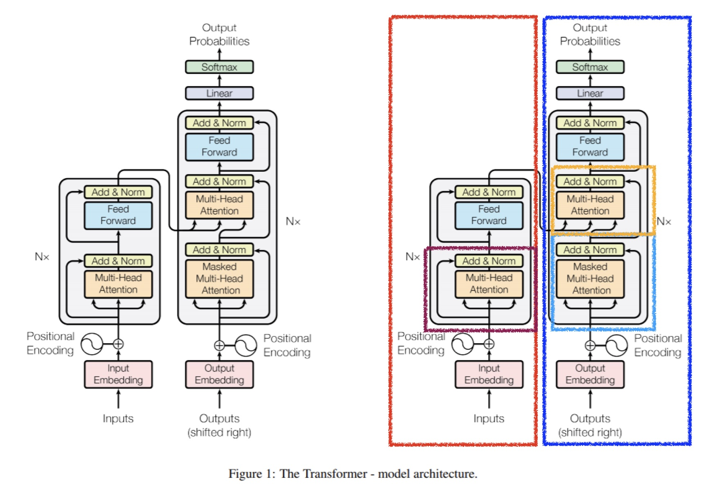
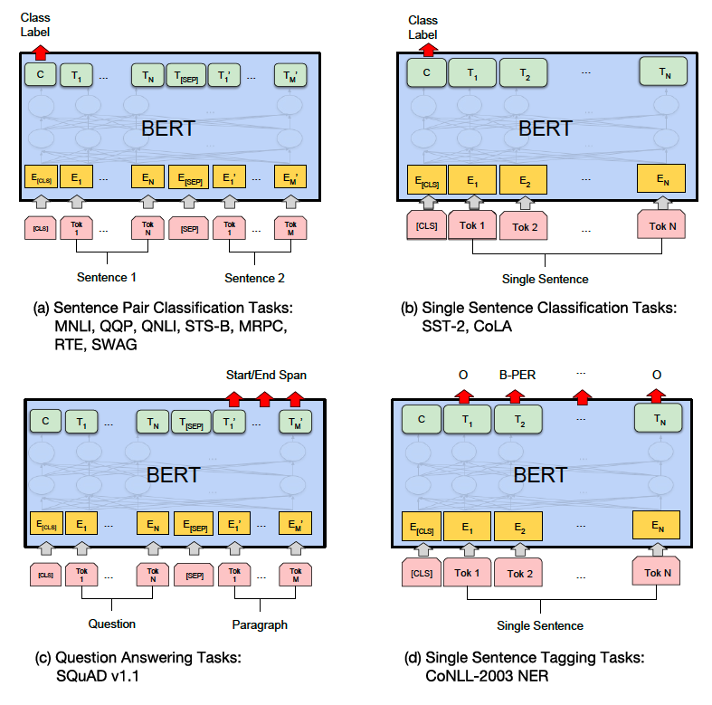
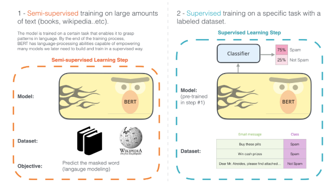
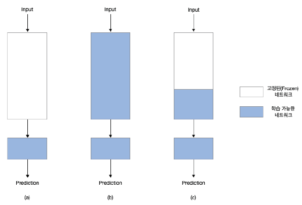
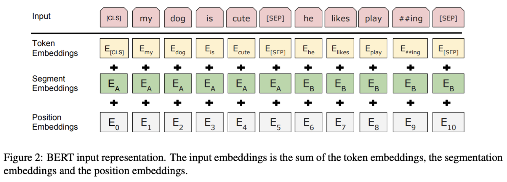
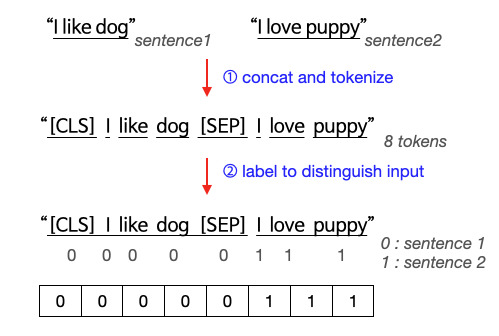
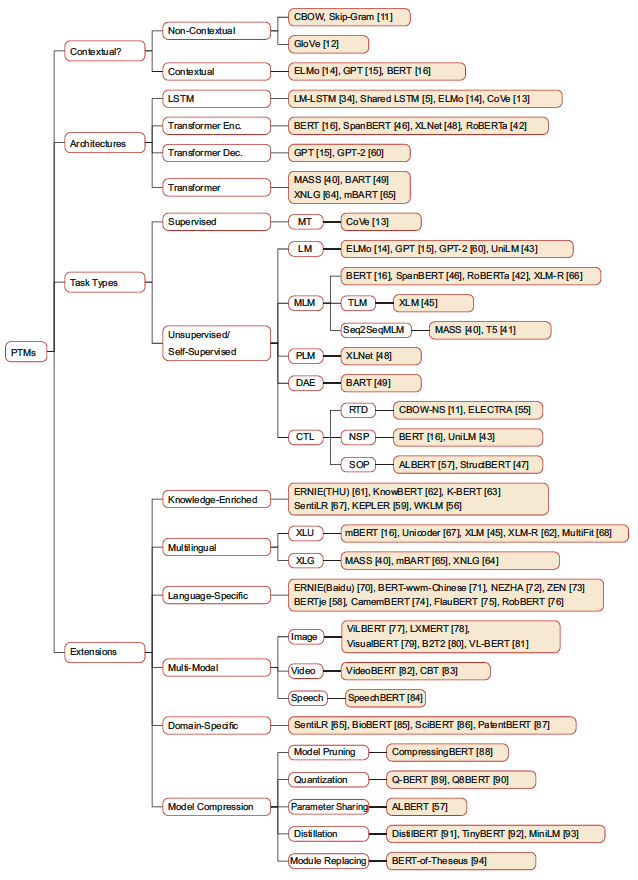

이 문서에서는 BERT에 대한 기본 내용을 설명한다. 또한 이 문서에 포함되어 있는 내용은 작성일(2021-02-24) 기준 내용이므로 참고하길 바란다.

## [ BERT란? ] 
BERT(버트, Bidirectional Encoder Representations from Transformers)는 2018년 11월,구글이 공개한 인공지능(AI) 언어모델이다. 자연어를 이해(Natural Language Understanding)하기 위한 모델로 사용되며, 이름에서도 알 수 있듯 Transformer 모델의 Encoder를 사용한 양방향 학습 모델이다.
 
BERT는 특히 자연어 처리에서 임베딩(Embedding)을 할 때 사용하는 사전 훈련 언어모델(Pre-training Language Model)로 주로 사용되고 있다. BERT가 등장하기 이전에는 Word2Vec, Glove, Fasttext, ELMo 등의 방식을 임베딩에 많이 사용했지만 요즘 고성능을 내는 대부분의 모델에서 BERT를 사용하고 있다고 한다.

### > 참고 - Transformer(self-attention)
역시 구글에서 2017년에 발표한 논문인 "Attention is all you need"에서 나온 모델로 기존의 seq2seq 구조인 인코더(Encoder)-디코더(Decoder) 구조를 따르면서도, 논문의 이름처럼 어텐션(Attention)만으로 구현한 모델이다 [3,5]. 즉 RNN, LSTM 등의 셀을 일체 사용하지 않고 Attention 구조만으로 time sequence를 인식하여 학습할 수 있는 모델이라는 뜻이다. 현재는 거의 모든 SOTA(state-of-the-art) 모델들(BERT, GPT등)이 Transformer 구조에 기반하여 구현되고 있다.

일반적인 Seq2Seq-Attention 모델에서도 원본 언어(Source Language)와 번역된 언어(Target Language)간의 대응 여부는 Attention을 통해 찾을 수 있었다. 하지만 각각 자신 언어만의 관계에 대해서는 나타낼 수 없었다. 예를 들면, <b><u>"I love tiger but it is scare"</u></b>와 <b><u>"나는 호랑이를 좋아하지만 그것(호랑이)는 무섭다"</u></b> 사이의 관계는 Attention을 통해 매칭이 가능했지만, <b><u>'it'</u></b>이 무엇을 나타내는지와 같은 문제는 기존 인코더-디코더 기반의 어탠션 매커니즘에서는 찾을 수 없었다. 하지만 Transformer 구조를 이용하여 위의 문제를 해결할 수 있게 되었다 [1, 2].

	

Transformer 모델의 구조도 내에서 각 부분이 담당하는 역할은 다음과 같다.

- 빨간색 : 인코더(Encoder)
- 파란색 : 디코더(Decoder)
- 보라색 : 인코더에서 Self-Attention이 일어나는 부분
- 하늘색 : 디코더에서 Self-Attention이 일어나는 부분
- 겨자색 : 인코더와 디코더의 Attention이 일어나는 부분

## [ BERT로 풀 수 있는 문제 유형 ]
BERT 모델은 대표적인 11개의 NLP 문제에 대해서 좋은 성능을 나타냈다. 대표적인 문제 유형을 논문에서는 (a)Sentence Pair Classification Task, (b)Single Sentence Classification, (c)Question Answering Task, (d)Single Sentence Tagging Tasks 이렇게 4가지로 나누었다. 

	

이러한 문제를 모델의 Input 형태와 따라 한번 더 구분해보면 다음과 같이 나눌 수 있다.

- 한 문장을 Input으로 결과를 낼 수 있는 문제
    1. 하나의 문장 분류(single sentence classification)
        - SST-2(Stanford Sentiment Treebank) : 영화 리뷰인 한 문장이 주어졌을 때, 감성 분류
        - CoLA(Corpus of Linguistic Acceptability) : 영어 문장이 언어학적으로 적합한지 이진 분류 예측
        - 외에도 스팸 메일 찾기, 문서의 카테고리 분류 등의 문제가 여기에 속한다 [13].
    2. 문장 내 단어 라벨링(single sentence tagging task)
        - CoNLL-2003 NER(Conference on Computational Natural Language Learning - 2003 Named Entity Recognition) : 한 문장이 주어졌을 때 네 가지 유형의 개체명(사람, 위치, 조직, 기타 항목)을 중심으로 개체명 예측
        - 외에도 긴 이름의 first/middle/last name을 라벨로 예측하거나 품사 태깅(POS Tagging, Part-of-Speech Tagging) 등의 문제가 여기에 속한다 [13].
- 한 쌍의 문장으로 Input으로 결과를 낼 수 있는 문제
    1. 문장 두 개의 관계 분류(sentence pair classification)
        - MNLI(Multi-Genre Natural Language Inference) : 한 쌍의 문장이 주어졌을 때, 두 번째 문장이 첫 번째 문장에 대해서 수반(entailment)/상충(contradiction)/중립(neutral)되는지 분류 예측
        - QQP(Quora Question Pairs) : Quora에 올라온 두 개의 질문이 의미론적으로 동일한지 확인하는 것이 목표인 이진 분류 예측
        - QNLI(Question Natural Language Inference) : QA 문제인 SQuAD 문제를 이진 분류 문제로 변환한 것이다. 문단(paragraph)이 있을때 주어진 질문(question)에 대하여 올바른 정답을 할 수 있을지 이진 분류 예측
        - STS-B(Seemantic Textual Similarity Benchmark) : 두 문장이 의미론적으로 얼마나 유사한지 1부터 5까지의 점수로 나타내는 분류 예측 문제
        - MRPC(Microsoft Research Paraphrate Corpus) : 두 문장의 의미론적으로 유사한지 이진 분류 예측 
        - RTE(Recognizing Textual Entailment) : MNLI와 유사한 이진 분류 예측, 하지만 데이터가 훨씬 적음
        - SWAG(The Situations With Adversarial Generations) : 한 문장이 주어졌을 때, 네 가지의 선택지 중에서 가장 잘 이어지는 문장을 찾는 문제
    2. 묻고 답하기(question & answering)
        - SQuAD v1.1(Stanford Question Answering Dataset) : 질문(question)과 문단(paragraph)이 주어졌을 때 문단 속에 있는 질문에 대한 답변(answer)의 위치를 예측, 이 문제를 읽기 이해(MRC, Machine Reading Comprehension)라고 할 수 있다.

## [ BERT 사용 방식 ]
우선 아래의 그림[7] 에서 볼 수 있듯, 실제로 해결하고자 하는 문제와 관련된 대량의 코퍼스(*corpus, 말뭉치)를 이용하여 BERT 모델을 학습한다. 그리고 Pre-trained BERT 모델과 결합된 예측 모델을 이용하여 실제 문제에서 사용되는 데이터로 학습(transfer learning) 시킨다. 이렇게 학습한 최종 모델을 이용하여 원하는 예측을 진행할 수 있다.

	

### > 참고 - Transfer Learning 방식
이러한 전이 학습 방식은 크게 두 가지로 나눌 수 있다. 하나는 아래 그림의 (a)와 같은 특성 추출(feature extraction) 방법이고, 다른 하나는 (b), (c)와 같은 미세 조정(fine tuning) 방법이다. 

특성 추출 방법은 데이터의 특성을 추출하는 부분의 네트워크를 고정하고 결과를 출력하는 계층인 예측 모델 계층을 해결하려는 문제에 맞도록 새롭게 정의하여 예측 모델 계층만 학습시키는 것이다. 

미세 조정 방법은 특성 추출을 할 때 고정했던 네트워크의 전체(b) 또는 일부(c)를 고정에서 해제하여 새롭게 학습시키는 것을 말한다. 이때 주의할 점은 특성 추출을 이용해서 예측 모델 계층을 먼저 훈련시킨 뒤, 미세 조정을 진행해야 한다는 점이다. 만약 그렇지 않으면 예측 모델 계층이 훈련되는 동안 너무 큰 오차 신호가 다른 네트워크로 전파되기 때문이다.
 

	

## [ BERT의 특징 ]
BERT의 Input은 아래의 그림처럼 Token Embedding + Segment Embedding + Position Embedding 으로 이루어진다 [1, 2].

	

### Token Embedding
Word Piece Embedding [9] 방식을 사용한다 [2]. (c.f. Byte Pare Encoding, BPE와 비슷) 

만약 모델이 모르는 단어가 등장하면 그 단어를 ‘단어 집합에 없는 단어’ 라는 의미에서 OOV(Out-Of-Vocabulary) 또는 UNK(Unknown Token)이라고 표현한다. Word Piece Embedding은 이처럼 세상의 모든 단어를 학습할 수 없는 문제가 있다. 이를 해결하기 위해 나온 알고리즘이고, 이를 이용하면 OOV나 희귀 단어, 신조어와 같은 문제를 완화시킬 수 있다고 알려져있다 [12].

하나의 단어는 더 작은 단위의 의미있는 여러 서브워드(subword)들의 조합으로 구성된 경우가 많다는 점을 이용해서 하나의 단어를 여러 서브워드로 분리해서 단어를 인코딩 및 임베딩하는 것을 말한다. 서브워드는 자주 등장하면서 가장 긴 길이의 서브워드를 하나의 단위로 만든다 [2].

<b>논문 예시)</b>

- 예시 [9]
    - Word : Jet makers feud over seat width with big orders at stake. 
    - Wordpieces : \_J et \_makers \_fe ud \_over \_seat \_width \_with \_big \_orders \_at \_stake
- 구분 표현
    -  _ : 원래 word를 구분
    - 띄어쓰기 : 하나의 word 내에서 자주 발생하는 subword로 나누는 것을 표현 

<b>다른 예시) </b>

- 예시 [12]
    - vocabulary에 low, lower, newest, widest 라는 단어들이 있을때, lowest라는 단어가 등장하면?
- 적용
    - [low], [low, er], [new, est], [wid, est]로 subword를 분리할 수 있고, lowest는 low + est의 의미로 구분할 수 있게될 것이다.

### Segment Embedding
토큰화(Tokenization) 시킨 단어들을 다시 하나의 문장으로 만드는 작업이다 [2]. 예를 들어 ("I like dog", "I love puppy")라는 한 쌍의 데이터가 있을 때, BERT 모델이 Input에서 각각의 문장인 "I like dog"와 "I love puppy"를 구별할 수 있도록 도와주는 방법이다.

Segment Embedding을 진행하는 과정을 나타내면 아래의 그림과 같다 [14]. 

	

이렇게 Segment Embedding을 진행하게 되면 BERT 모델이 서로 다른 문장의 각각의 토큰(token)을 구분할 수 있게 만들어준다. 만약 모델의 Input이 하나 밖에 없는 문제의 경우, 즉 위의 예시에서 모델의 Input이 "I like dog" 문장 밖에 없는 문제의 경우에는 Segment Embedding이 모두 0에 해당하는 벡터로 나타난다 [14]. 

### Position Embedding
...

## [ BERT 학습 방법 ]
BERT는 언어의 특성을 잘 학습하도록 MLM(Masked Language Model)과 NSP(Next Sentence Prediction) 방식을 이용하여 Pre-Training을 진행한다.

### MLM(Masked Language Model)
...

### NSP(Next Sentence Prediction)
...

### > 참고 - 문맥 의존 방법(단방향 또는 얕은 양방향, 깊은 양방향) vs 문맥에 의존하지 않는 방법 [8]
...

## [ 이후에 나온 다른 Pre-trained 모델 ]
- GPT
- BART
- ELECTRA
- 등등
- [6]...

	

## [ Future work ]
- BERT의 내부 특징 학습 및 정리
- BERT의 Pre-training 방법 학습 및 정리
- NLP Pre-trained 모델 survey 논문 읽고 정리
 

## Reference
- [1] [BERT 논문 - BERT: Pre-training of Deep Bidirectional Transformers for Language Understanding](https://arxiv.org/pdf/1706.03762.pdf)
- [2] [BERT 설명 국문 블로그 1](https://ebbnflow.tistory.com/151)
- [3] [Transformer(self-attention) 논문 - Attention Is All You Need](https://arxiv.org/pdf/1706.03762.pdf)
- [4] [Transformer(self-attention) 설명 국문 블로그 1](https://medium.com/platfarm/%EC%96%B4%ED%85%90%EC%85%98-%EB%A9%94%EC%BB%A4%EB%8B%88%EC%A6%98%EA%B3%BC-transfomer-self-attention-842498fd3225)
- [5] [Transformer(self-attention) 설명 국문 블로그 2](https://wikidocs.net/31379)
- [6] [NLP pre-trained model survey 논문 - Pre-trained models for natural language processing](https://link.springer.com/article/10.1007/s11431-020-1647-3)
- [7] [bert 관련 이미지](http://jalammar.github.io/illustrated-bert/)
- [8] [인공지능 신문 - BERT](http://www.aitimes.kr/news/articleView.html?idxno=13117)
- [9] [Word Piece Embedding 논문 - Google’s Neural Machine Translation System: Bridging the Gap between Human and Machine Translation](https://arxiv.org/pdf/1609.08144.pdf)
- [10] [Word Piece Embedding 설명 국문 블로그 1](https://ai-information.blogspot.com/2019/02/word-piece-embedding.html)
- [11] [Word Piece Embedding 설명 국문 블로그 2](https://lovit.github.io/nlp/2018/04/02/wpm/)
- [12] [Byte Pair Encoding 설명 국문 블로그](https://wikidocs.net/22592)
- [13] [BERT 설명 국문 블로그 2](https://jiho-ml.com/weekly-nlp-28/)
- [14] [BERT 설명 국문 블로그 3](https://medium.com/@_init_/why-bert-has-3-embedding-layers-and-their-implementation-details-9c261108e28a)