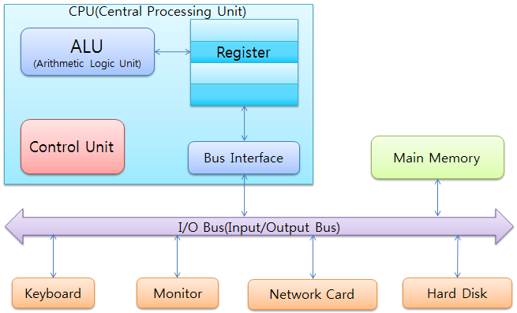
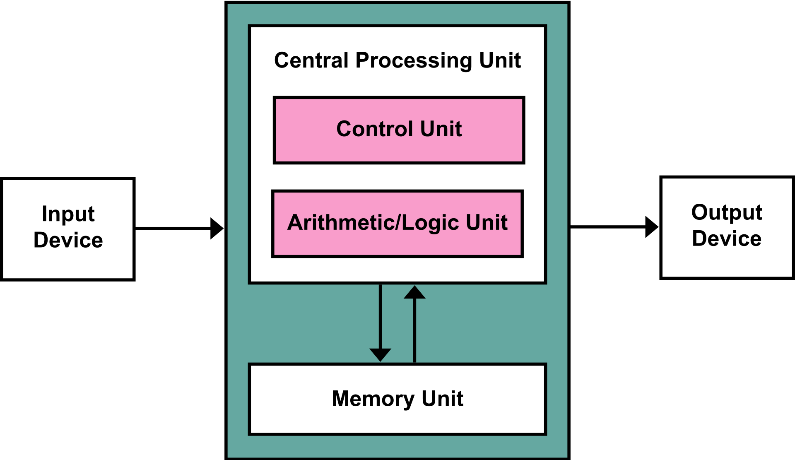
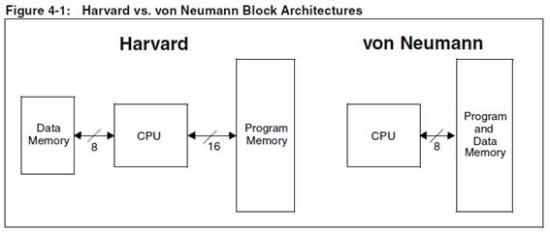
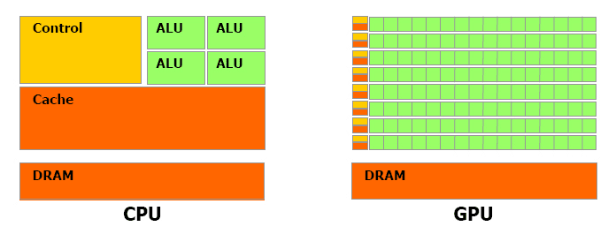

이 문서에서는 CPU, GPU 그리고 TPU에 대하여 설명한다. 참고할 수 있도록 필자가 참고했던 페이지를 포스트의 마지막에 reference로 추가하였다. 또한 이 문서에 포함되어 있는 내용은 작성일(2021-05-13) 기준 내용이므로 참고하길 바란다.

## CPU
- CPU(Centralized Processing Unit) : 중앙 처리 장치
- CPU 구성
    - 산술 논리 장치(ALU, Arithmetic and Logical Unit) : 산술 논리 연산 또는 정수 연산 을 처리하는 장치, 연산만 담당할 뿐 명령어 해석은 불가능
    - 컨트롤 유닛(Control Unit) : 명령어를 해석하고 레지스터와 ALU 사이의 명령 흐름을 제어한다. 즉 명령어를 해석하고 연산을 수행할 수 있게 ALU에 명령어를 내리는 역할을 한다.
    - 레지스터(Register Set) : 임시로 데이터를 기억하는 장치이다. 연산 후에 나오는 임시 데이터를 저장하거나, CPU의 상태, 다음 명령어의 메모리 번지수 등이 레지스터에 기억된다. 
    - 버스 인터페이스(Bus Interface) : 외부의 입출력 버스(I/O Bus)와 연결된다. 즉, CPU의 외부와 데이터를 주고받는 통로이다.
    

        
    

- CPU가 실행하는 명령어를 처리하는 순서
    1. fetch : 메모리로부터 명령어를 가져옴
    2. decode : 명령어의 의미를 해석
    3. execute : 명령어를 실행
    4. store : 결과를 저장
- 모든 CPU는 기계어를 실행한다. 하지만 CPU 종류마다 실행할 수 있는 기계어의 종류는 다를 수 있다. 이런 기계어의 모음을 ISA(Instruction Set Architecture)라고 한다.

### 폰노이만 구조와 하버드 구조

#### 폰노이만 구조

    

- 중앙처리장치(CPU), 메모리, 프로그램 세 가지 요소로 구성되어 있다.
- CPU와 메모리는 서로 분리되어 있고, 둘을 연결하는 버스(Bus)를 통해 명령어 읽기, 데이터의 읽고 쓰기가 가능
- 현재와 같은 CPU, 메모리, 프로그램 구조를 갖는 범용 컴퓨터 구조의 확립
- 이후에 나온 모든 컴퓨터는 모두 폰 노이만의 설계를 기본 구조로 디자인되고 있음
- 장점
    - 가장 큰 장점은 프로그램 내장 방식 컴퓨터라는 점이다.
	    - 이전 컴퓨터는 1+1 이라는 명령을 수행하려면 하드웨어의 전선을 직접 1, 더하기, 1을 의미하는 것으로 매번 바꿔 끼워 입력해야했음
	    - 하지만 폰노이만 구조에서는 더하기, 빼기 기능을 담은 소프트웨어가 메모리 안에 내장되어 있어서 필요할 때마다 메모리 안의 프로그램과 데이터를 CPU에 전달하여 계산을 처리
	    - 하드웨어는 그대로 두고 소프트웨어(프로그램)만 교체하면 되기때문에 편의성이 크게 증가하였고 다양한 목적으로 사용이 가능해져 범용성이 향상되었음
	- 프로그램 내장박식으로 인해 범용성이 크게 향상되었다.
- 단점
    - 폰 노이만 구조는 ‘내장 메모리 순차처리 방식’을 따르고 있기 때문에 CPU는 순차적으로 한 번에 명령어 하나씩만 실행한다. 
    - 내장 메모리 순차처리 방식으로 데이터 메모리와 프로그램 메모리가 구분되어 있지 않고 하나의 버스를 가지고 있는 구조 때문에 CPU가 명령어와 데이터에 동시 접근할 수 없다. 이를 해결하고나 나타난 구조가 하버드 구조이다.
    - 또한 메모리의 값을 읽고 쓰는 구조이기 때문에 기억장치에 병목현상이 생길 수 밖에 없다. 이를 해결하고자 나타난 기술에는 메모리 계층 구조나 NUMA, DMA 등이 있다. 

#### 하버드 구조

    

- 명령용 버스와 데이터용 버스로 물리적으로 분할한 컴퓨터 아키텍처를 나타내는 용어이다.
- 장점
    - 폰노이만 구조에서는 CPU가 명령어와 데이터에 동시에 접근이 불가능해서 한번에 하나씩 처리할 수 없었던 반면에, 하버드 아키텍처의 컴퓨터에서는 명령을 메모리로부터 읽는 것과 데이터를 메모리로부터 읽는 것을 동시에 할 수 있다.
    - 따라서 현재 명령의 처리를 끝냄과 동시에 다음 명령을 읽어 들일 수 있어서 더 빠른 속도를 낼 수 있다.
- 단점
    - 많은 전기 회로가 필요하고, 두개의 버스와 메모리를 가지게 되므로 CPU코어에서 공간을 많이 차지한다.

#### 오늘날 CPU 구조
- 오늘날의 CPU는 폰노이만 구조를 기반으로 하버드 구조를 적용한 구조 형태로 발전하였다.
- 하지만 결국 폰노이만 구조를 기반으로 만들어진 것이기 때문에, 병목현상만 어느 정도 해결할 뿐 메모리 속의 프로그램을 순차적으로 실행하는 근본적인 구조 자체는 변하지 않는다.
- CPU의 클럭을 높여서 처리 속도가 빨라지더라도 높아진 클럭 만큼의 계산만 더 할 수 있다. 클럭의 개선이 발열 등의 문제로 인해 한계에 다다른 이후 CPU의 발전은 multi-core, hyper-threading 과 같이 동시에 구동할 수 있는 코어의 개수를 늘리는 방향으로 이루어지고 있다.

## GPU
- GPU(Graphic Processing Unit) : 그래픽 처리 장치
- GPU 는 단순한 형태의 대량 계산을 CPU로부터 독립시키기 위하여 고안된 Co-processor이다. 
- 그래픽 처리에 필요한 계산에는 복잡한 명령어 세트나 많은 수의 레지스터가 필요하지 않고, 복잡한 캐시 구조도 필요 없다. 그냥 동일한 형태의 계산(부동 소수점 곱셈)을 대량으로 수행하면 된다.
- 따라서 GPU는 CPU 코어의 복잡한 구조를 단순화하여 개별 계산당 비용을 극단적으로 낮추고 대신 단순한 형태의 코어를 대량으로 집적하여 단순 연산을 병렬로 수행한다.

    

- 그래픽 처리는 일반적인 CPU 연산에 비해 엄청나게 많은 수의 부동소수점 곱셈 연산을 발생시킨다.
- CPU는 폰노이만구조에 기반하여 한 번에 하나의 트랜잭션을 처리하는 순차처리 방식을 따르기 때문에 수 많은 부동 소수점 곱셈 연산이 한번에 하나씩 순차적으로 처리될 것이다. 이는 정작 중요한 프로그램의 구동이 단순 연산을 수행하느라 대기하게 되는 것을 의미한다.
- 예를 들면, 고사양의 게임을 구동했는데 화면에 그래픽을 그리느라 키보드 입력이 안되는 문제가 발생하는 등의 문제가 발생할 수 있다는 것이다.

### 인공지능 분야에서 GPU의 사용
- AI 추론이나 학습을 할 때 핵심적으로 필요한 연산은 매트릭스 합성곱(convolution) 연산이다. 즉, 수 많은 행렬 연산이 필요하다. 이것을 값비싸고 범용적으로 사용할 수 있는 CPU를 사용해서 할 필요는 없다.
- 단순 연산을 병렬로 수행하기 때문에 CPU에 비해 처리 속도가 빠르다.
- 딥러닝 학습이나 추론 과정에서 곱셈이 많이 발생한다 하더라도 곱셈기만 있다고 딥러닝 학습이 되는 것은 아니다. 곱셈을 어떻게 처리하고 결과는 어떻게 정리할 것인지 GPU에게 지시를 하는 방법이 필요하다.
    - GPU 를 이용해 일련의 과정을 수행하기 위해서 NVIDIA 에서는 GPU 를 사용하기 위한 CUDA 와 cuDNN (CUDA Deep Neural Network library) 을 제공한다. CUDA 는 C 언어를 이용하여 GPU 의 계산을 스케줄링할 수 있도록 제공하는 GPU 제조사 NVIDIA 의 일종의 SDK(Software Development Kit)이다.
    - CUDA 를 이용하여 병렬 계산 알고리즘을 구현할 수 있고, cuDNN 을 이용하면 기본적인 딥러닝 primitive(기본적인 동작)들을 편리하게 구현할 수 있다. 
- 단점
    - GPU는 병렬 계산을 수행하므로 수천 개의 ALU의 모든 단일 계산에 대해 중간 계산 결과를 읽고 저장하기 위해 레지스터 또는 공유 메모리에 액세스해야한다. 
    - 따라서 메모리 액세스에 많은 자원을 소비한다.
    - 많은 전력이 소모되고, 발열이 심하다.

## TPU 
- TPU(Tensor Processing Unit) : 텐서 처리 장치
- 구글은 GPU를 CPU와 마찬가지로 여전히 수백만 개의 서로 다른 애플리케이션과 소프트웨어를 지원해야하는 범용 프로세서로 보았다.
- 따라서 범용 프로세서를 설계하는 대신 신경망 작업 부하에 특화된 매트릭스 프로세서(matrix processor)로 설계하였다.
- 훨씬 적은 전력을 소비하고 신경망에 대한 대규모 곱셈과 덧셈을 처리할 수 있다고 한다.
- 그리고 2020년 7월, 가장 최신의 4세대 TPU를 공개했다. 4세대 TPU는 높은 성능으로 주목을 받았다. 강화학습만을 통해 바둑 플레이를 한 알파고 제로에는 TPU 2000개가 탑재됐다. 하지만 4세대 TPU는 하나만 탑재해도 알파고 제로를 실행할 수 있다. 하나만으로 슈퍼컴퓨터를 수행할 수 있는 하드웨어가 탄생한 셈이다. 해당 프로세서는 구글이 2018년 1월 공개했던 인공지능 언어 모델 ‘버트(BERT)’를 강화하는 데 사용되고 있다.
- [데모사이트 보고 내용 추가하기](https://storage.googleapis.com/nexttpu/index.html)

## Reference
- [[1] CPU GPU TPU NPU](https://voidint.com/2020/10/14/cpu-gpu-tpu-npu/)
- [[2] 폰노이만 구조 - 1](https://velog.io/@ckstn0777/%EC%BB%B4%ED%93%A8%ED%84%B0-%EA%B5%AC%EC%A1%B0)
- [[3] 폰노이만 구조 - 2](https://m.blog.naver.com/with_msip/221981730449)
- [[4] CPU 구성](https://exynoa.tistory.com/212?category=481025)
- [[5] TPU - 1](https://voidint.com/2020/11/25/gpu-vs-npu-deeplearning-difference/)
- [[6] TPU - 2](http://www.donghyun53.net/%EA%B5%AC%EA%B8%80-tpu-%EB%93%A4%EC%97%AC%EB%B3%B4%EA%B8%B0/)
- [[7] TPU - 3](https://byline.network/2020/12/17-114/)
- [[8] CPU, GPU, TPU](https://serverguy.com/comparison/cpu-vs-gpu-vs-tpu/)
- [CPU 이미지](https://exynoa.tistory.com/212?category=481025)
- [폰노이만 구조 이미지](https://ko.wikipedia.org/wiki/%ED%8F%B0_%EB%85%B8%EC%9D%B4%EB%A7%8C_%EA%B5%AC%EC%A1%B0#/media/%ED%8C%8C%EC%9D%BC:Von_Neumann_Architecture.svg)
- [하버드 구조 vs 폰노이만 구조 이미지](https://velog.io/@ckstn0777/%EC%BB%B4%ED%93%A8%ED%84%B0-%EA%B5%AC%EC%A1%B0)
- [CPU 구조 vs GPU 구조 비교 이미지](https://voidint.com/2020/10/14/cpu-gpu-tpu-npu/)

## To-Do
- TPU 내용 추가
- BERT 포스트 정리(+개념추가)
- 블로그 구조 정리, 꾸미기
- 수식 자연스럽게 로드되도록 고치기